# GLSL Plugin System - Comprehensive Technical Documentation

**Timestamp**: 2025-09-05 21:08  
**Project**: Dynamic GLSL Shader Plugin System for OpenFrameworks  
**Version**: Production-ready with advanced features in development

---

## Table of Contents

1. [System Overview](#1-system-overview)
2. [Core Architecture](#2-core-architecture)
3. [Plugin System](#3-plugin-system)
4. [Shader System](#4-shader-system)
5. [Expression System](#5-expression-system)
6. [OSC Communication](#6-osc-communication)
7. [Composition Engine](#7-composition-engine)
8. [Data Flow Analysis](#8-data-flow-analysis)
9. [Performance Characteristics](#9-performance-characteristics)
10. [Error Handling](#10-error-handling)

---

## 1. System Overview

### 1.1 Core Concept

The GLSL Plugin System transforms GLSL shader libraries into dynamically loadable C++ plugins, enabling runtime shader compilation and execution. The system provides automatic wrapper function generation, type inference, and complex expression parsing.

### 1.2 Key Features

- **Dynamic Plugin Loading**: Runtime loading of `.so` libraries containing GLSL functions
- **Automatic Type Conversion**: Intelligent wrapper generation adapts user arguments to function signatures
- **Expression Parsing**: Mathematical expression evaluation with GLSL code generation
- **OSC Integration**: Remote control via Open Sound Control protocol
- **Deferred Compilation**: Graph-based shader composition for optimal performance
- **Built-in Variable System**: Automatic management of time, resolution, and coordinate uniforms

### 1.3 Architecture Diagram

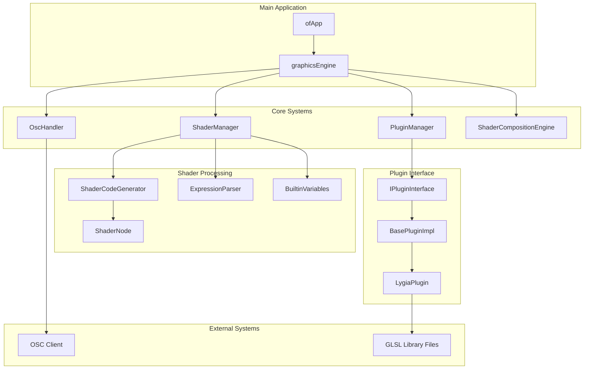

---

## 2. Core Architecture

### 2.1 Main Components

#### 2.1.1 graphicsEngine (`src/geMain.h/cpp`)

Central orchestrator managing all subsystems. Implements the facade pattern to provide unified interface.

**Key Responsibilities:**
- Plugin lifecycle management
- Shader system initialization
- OSC message coordination
- Shader ID management for remote control

**State Management:**
```cpp
// Core managers
std::unique_ptr<PluginManager> plugin_manager;
std::unique_ptr<ShaderManager> shader_manager;
std::unique_ptr<ShaderCompositionEngine> composition_engine;
std::unique_ptr<OscHandler> osc_handler;

// Shader tracking
std::shared_ptr<ShaderNode> current_shader;
std::map<std::string, std::shared_ptr<ShaderNode>> active_shaders;
```

#### 2.1.2 ofApp (`src/ofApp.h/cpp`)

OpenFrameworks application wrapper providing graphics context and event handling.

**Core Functions:**
- Initialization sequence coordination
- Real-time rendering loop
- User input processing
- Graphics canvas management

### 2.2 Initialization Sequence

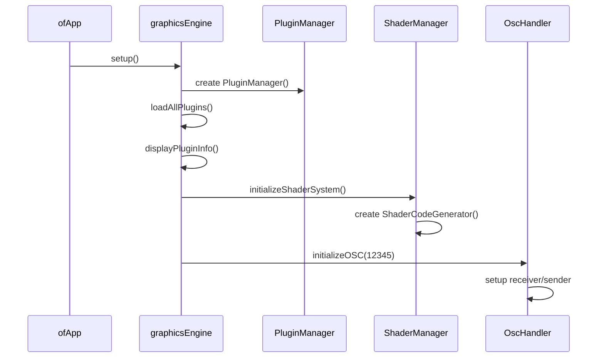

### 2.3 Runtime Loop

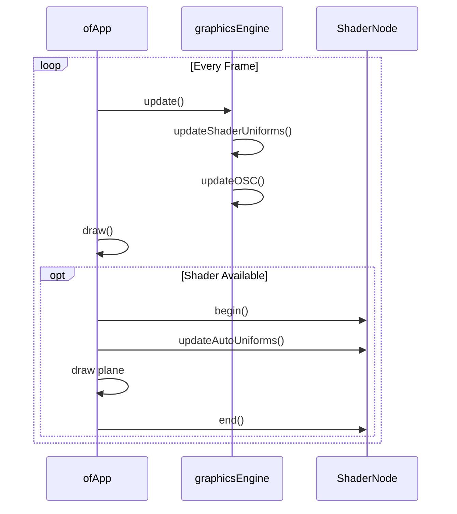

---

## 3. Plugin System

### 3.1 Architecture Overview

The plugin system uses dynamic library loading to provide modular GLSL function collections.

#### 3.1.1 PluginManager (`src/pluginSystem/PluginManager.h/cpp`)

Handles dynamic library lifecycle and function discovery.

**Core Operations:**
- Dynamic library loading via `dlopen()`
- ABI version compatibility checking
- Function metadata caching
- GLSL built-in conflict detection

**Plugin Discovery Process:**
```cpp
// File scanning
std::vector<std::string> findPluginFiles() {
    // Scans data/plugins/ for .so files
    // Returns absolute paths to all valid plugins
}

// Loading sequence
bool loadPlugin(const std::string& plugin_path, const std::string& alias) {
    void* handle = dlopen(plugin_path.c_str(), RTLD_LAZY);
    // ABI version check
    // Symbol resolution (createPlugin, destroyPlugin, getPluginInfo)
    // Instance creation and path configuration
}
```

#### 3.1.2 LoadedPlugin Structure

Internal plugin representation with RAII cleanup:

```cpp
struct LoadedPlugin {
    void* handle;               // dlopen handle
    IPluginInterface* interface; // Plugin instance
    std::string name, version, author, path;
    
    ~LoadedPlugin() {
        // Automatic cleanup via destroyPlugin() function
        // Library handle closure via dlclose()
    }
};
```

### 3.2 Plugin Interface

#### 3.2.1 IPluginInterface (`glsl-plugin-interface/include/IPluginInterface.h`)

Standard interface for all plugins:

```cpp
class IPluginInterface {
public:
    virtual const char* getName() const = 0;
    virtual const GLSLFunction* findFunction(const std::string& name) const = 0;
    virtual std::vector<std::string> getAllFunctionNames() const = 0;
    virtual std::vector<std::string> getFunctionsByCategory(const std::string& category) const = 0;
    virtual void setPath(const std::string& path) = 0;
};
```

#### 3.2.2 C ABI Compatibility

Plugin loading uses C linkage for cross-compiler compatibility:

```cpp
extern "C" {
    int getPluginABIVersion() { return PLUGIN_ABI_VERSION; }
    IPluginInterface* createPlugin() { return new LygiaPlugin(); }
    void destroyPlugin(IPluginInterface* plugin) { delete plugin; }
    const char* getPluginInfo() { return "Plugin metadata"; }
}
```

### 3.3 Function Metadata System

#### 3.3.1 GLSLFunction Structure

Function definitions include complete signature information:

```cpp
struct GLSLFunction {
    std::string name;
    std::string category;
    std::string description;
    std::string filePath;               // Relative path to .glsl file
    std::vector<FunctionOverload> overloads;
};

struct FunctionOverload {
    std::string returnType;             // GLSL return type
    std::vector<std::string> paramNames;
    std::vector<std::string> paramTypes; // GLSL parameter types
    std::string signature;              // Human-readable signature
};
```

#### 3.3.2 Built-in Conflict Detection

The system detects naming conflicts with GLSL built-ins:

```cpp
// MinimalBuiltinChecker validates against GLSL specification
bool hasBuiltinConflict(const std::string& function_name) const;

// Runtime warnings for conflicting functions
void logRuntimeConflictWarning(const std::string& function_name, 
                              const std::string& plugin_name) const;
```

---

## 4. Shader System

### 4.1 ShaderManager (`src/shaderSystem/ShaderManager.h/cpp`)

Central shader orchestrator handling creation, caching, and lifecycle management.

#### 4.1.1 Core Workflow

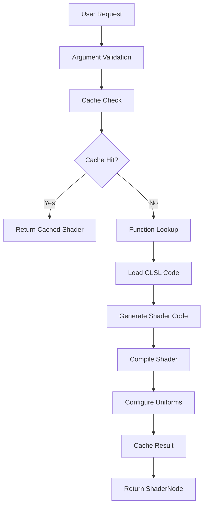

#### 4.1.2 Caching System

Performance-optimized caching with key generation:

```cpp
class ShaderManager {
private:
    // Function-argument combination cache
    std::unordered_map<std::string, std::shared_ptr<ShaderNode>> shader_cache;
    
    // ID-based active shader management
    std::unordered_map<std::string, std::shared_ptr<ShaderNode>> active_shaders;
    
public:
    std::string generateCacheKey(const std::string& function_name, 
                                const std::vector<std::string>& arguments);
};
```

### 4.2 ShaderNode (`src/shaderSystem/ShaderNode.h/cpp`)

Individual shader instance with comprehensive state management.

#### 4.2.1 State Machine

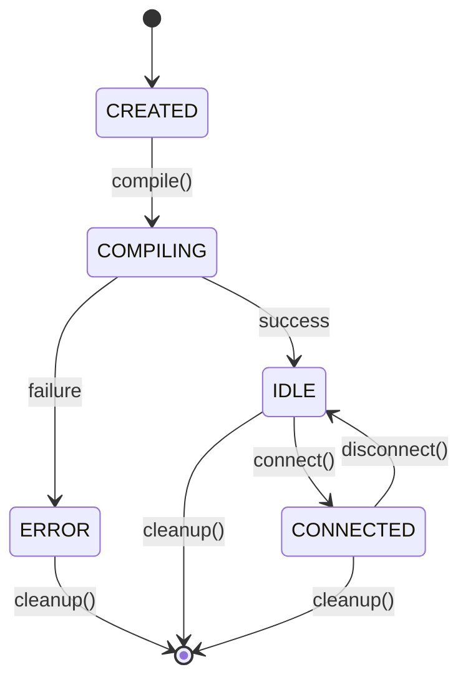

#### 4.2.2 Uniform Management

Automatic and manual uniform handling:

```cpp
class ShaderNode {
    // Automatic uniforms (updated per frame)
    bool auto_update_time;
    bool auto_update_resolution;
    
    // User-defined uniforms
    std::map<std::string, float> float_uniforms;
    std::map<std::string, ofVec2f> vec2_uniforms;
    
    void updateAutoUniforms() {
        if (auto_update_time)
            compiled_shader.setUniform1f("time", ofGetElapsedTimef());
        if (auto_update_resolution)
            compiled_shader.setUniform2f("resolution", ofGetWidth(), ofGetHeight());
    }
};
```

### 4.3 ShaderCodeGenerator (`src/shaderSystem/ShaderCodeGenerator.h/cpp`)

Template-based shader code generation with expression integration.

#### 4.3.1 Code Generation Pipeline

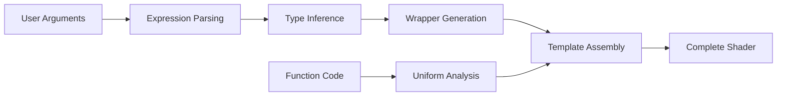

#### 4.3.2 Template Structure

```glsl
// Fragment shader template with placeholders
#version 330
uniform float time;
uniform vec2 resolution;

/*FUNCTION_CODE_PLACEHOLDER*/
/*WRAPPER_FUNCTION_PLACEHOLDER*/

void main() {
    /*VARIABLE_DECLARATIONS_PLACEHOLDER*/
    /*MAIN_FUNCTION_CALL_PLACEHOLDER*/
}
```

### 4.4 Wrapper Function System

#### 4.4.1 Automatic Signature Adaptation

The system generates wrapper functions to adapt user arguments to function signatures:

```glsl
// Original function: float snoise(vec2)
// User call: snoise(time, st.x)
// Generated wrapper:
float snoise(float arg0, float arg1) {
    return snoise(vec2(arg0, arg1));
}
```

#### 4.4.2 Best Overload Selection

Algorithm for function overload selection:

```cpp
const FunctionOverload* findBestOverload(
    const GLSLFunction* function_metadata,
    const std::vector<std::string>& user_arguments) {
    
    // 1. Calculate total component count from user arguments
    // 2. Find exact match for single vector parameter
    // 3. Find exact match for multi-parameter signature  
    // 4. Fallback to closest component count match
}
```

---

## 5. Expression System

### 5.1 ExpressionParser (`src/shaderSystem/ExpressionParser.h/cpp`)

Mathematical expression parsing using muParser library with GLSL output.

#### 5.1.1 Expression Processing Pipeline

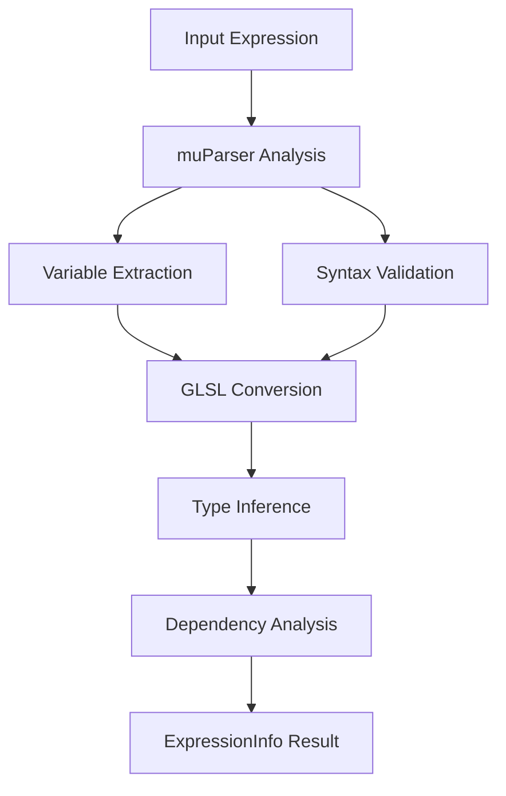

#### 5.1.2 Expression Types

```cpp
struct ExpressionInfo {
    std::string original;           // "sin(time*0.1)"
    std::string glsl_code;         // "sin(time*0.1)"
    std::string type;              // "float"
    std::vector<std::string> dependencies; // ["time"]
    bool is_simple_var;            // false
    bool is_constant;              // false
    double constant_value;         // 0.0
};
```

### 5.2 BuiltinVariables (`src/shaderSystem/BuiltinVariables.h/cpp`)

Singleton managing shader built-in variables with swizzle support.

#### 5.2.1 Variable Definitions

```cpp
void initializeBuiltins() {
    builtins["st"] = BuiltinVariable(
        "st", "vec2", 2,           // name, type, component count
        true, true,                // needs uniform, needs declaration
        "vec2 st = gl_FragCoord.xy / resolution;"
    );
    
    builtins["time"] = BuiltinVariable(
        "time", "float", 1,
        true, false, ""            // uniform only, no declaration
    );
}
```

#### 5.2.2 Swizzle Validation

```cpp
bool isValidSwizzle(const std::string& variable, std::string& errorMessage) {
    // Examples: "st.x", "st.xy", "resolution.y"
    std::string baseVar = extractBaseVariable(variable); // "st"
    std::string swizzle = extractSwizzle(variable);      // "xy"
    
    // Validate against component count
    const BuiltinVariable* info = getBuiltinInfo(baseVar);
    std::string validComponents = getSupportedSwizzleComponents(baseVar);
    
    // Check each swizzle character
    for (char c : swizzle) {
        if (validComponents.find(c) == std::string::npos) {
            errorMessage = "Invalid swizzle...";
            return false;
        }
    }
    return true;
}
```

---

## 6. OSC Communication

### 6.1 OscHandler (`src/oscHandler/oscHandler.h/cpp`)

OSC message processing for remote shader control.

#### 6.1.1 Message Types

```cpp
// Create shader node
struct OscCreateMessage {
    std::string function_name;      // "snoise"
    std::string raw_arguments;      // "time,st.x,1.0"
    bool is_valid_format;
    std::string format_error;
};

// Connect shader to output
struct OscConnectMessage {
    std::string shader_id;          // "shader_001"
    bool is_valid_format;
    std::string format_error;
};

// Free shader memory
struct OscFreeMessage {
    std::string shader_id;          // "shader_001"
    bool is_valid_format;
    std::string format_error;
};
```

#### 6.1.2 Message Processing Flow

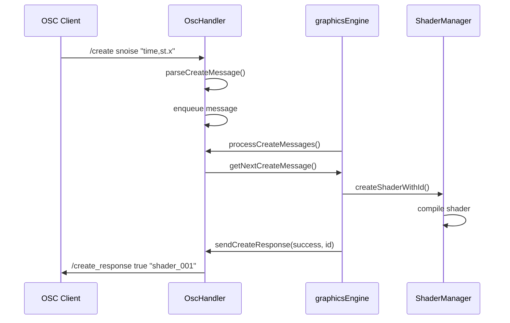

### 6.2 Command Protocol

| Command | Parameters | Response | Description |
|---------|------------|----------|-------------|
| `/create` | `function_name` `"arg1,arg2,..."` | `/create_response` `success` `shader_id` | Create shader from function |
| `/connect` | `shader_id` | `/connect_response` `success` `message` | Connect shader to output |
| `/free` | `shader_id` | `/free_response` `success` `message` | Free shader memory |

---

## 7. Composition Engine

### 7.1 ShaderCompositionEngine (`src/shaderSystem/ShaderCompositionEngine.h/cpp`)

Advanced deferred compilation system for shader graph optimization.

#### 7.1.1 Node-Based Architecture

```cpp
struct CompositionNode {
    std::string function_name;                    // "blur"
    std::vector<std::string> arguments;           // ["$shader_001", "0.1"]
    std::vector<CompositionNode*> input_nodes;    // Dependencies
    std::string node_id;                         // "node_002"
    std::vector<std::string> resolved_arguments;  // ["texture_sample", "0.1"]
    bool is_external_dependency;
};
```

#### 7.1.2 Deferred Compilation Process

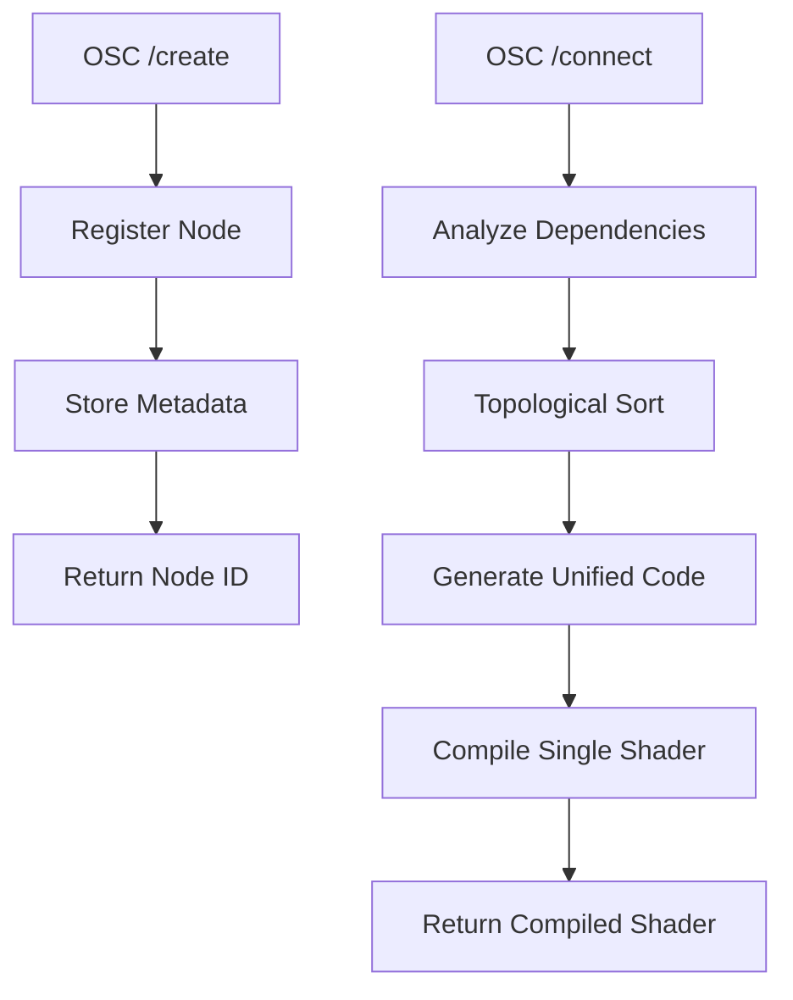

#### 7.1.3 Graph Analysis Algorithm

```cpp
bool topologicalSort(const std::string& output_node_id, 
                    std::vector<std::string>& sorted_nodes) {
    std::unordered_map<std::string, bool> visited;
    std::unordered_map<std::string, bool> rec_stack;
    
    return topologicalSortDFS(output_node_id, visited, rec_stack, sorted_nodes);
}

bool topologicalSortDFS(const std::string& node_id,
                       std::unordered_map<std::string, bool>& visited,
                       std::unordered_map<std::string, bool>& rec_stack,
                       std::vector<std::string>& sorted_nodes) {
    // Cycle detection and dependency ordering
    if (rec_stack[node_id]) return false; // Circular dependency
    if (visited[node_id]) return true;     // Already processed
    
    visited[node_id] = true;
    rec_stack[node_id] = true;
    
    // Recursively visit dependencies
    // Add to sorted list in reverse topological order
}
```

---

## 8. Data Flow Analysis

### 8.1 Shader Creation Flow

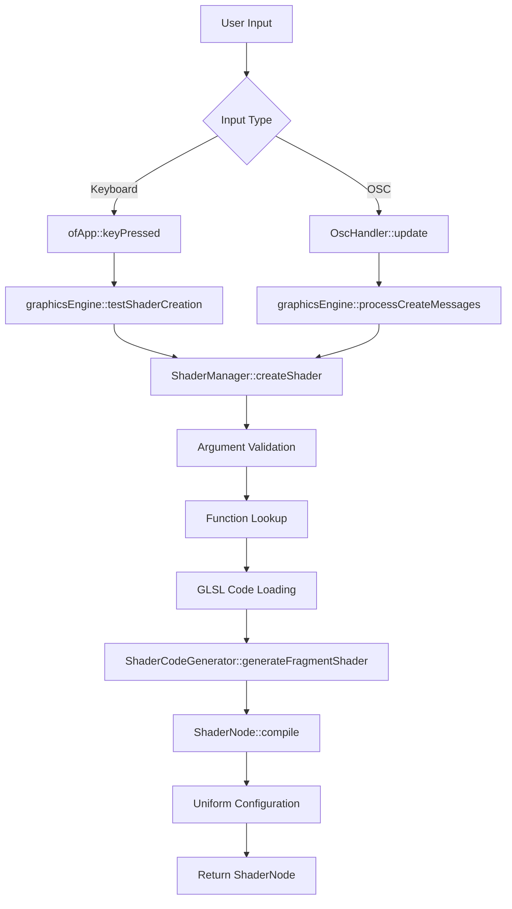

### 8.2 Plugin Loading Flow

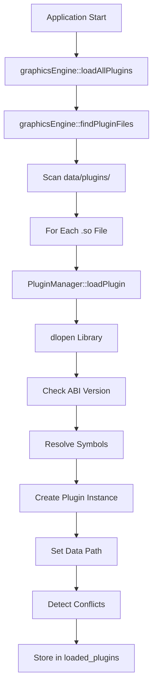

### 8.3 Uniform Update Flow

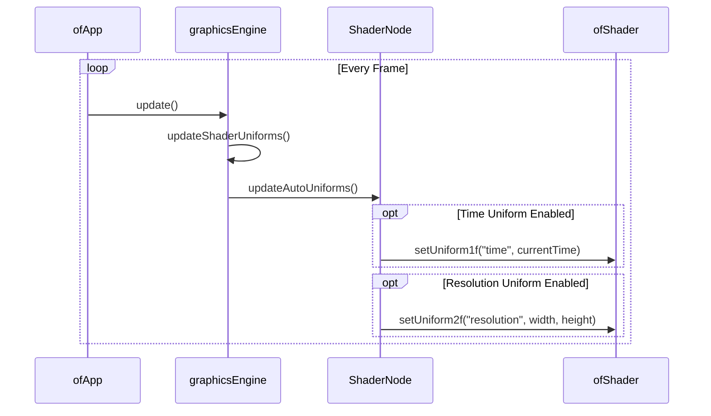

---

## 9. Performance Characteristics

### 9.1 Memory Management

#### 9.1.1 RAII Pattern Implementation

All major components use RAII for automatic resource cleanup:

```cpp
// ShaderNode destructor
~ShaderNode() {
    cleanup(); // Automatic OpenGL resource cleanup
}

// LoadedPlugin destructor  
~LoadedPlugin() {
    if (interface && handle) {
        destroy_plugin_t destroy_plugin = (destroy_plugin_t) dlsym(handle, "destroyPlugin");
        if (destroy_plugin) destroy_plugin(interface);
        dlclose(handle);
    }
}
```

#### 9.1.2 Smart Pointer Usage

Consistent use of smart pointers prevents memory leaks:

```cpp
// Unique ownership
std::unique_ptr<PluginManager> plugin_manager;
std::unique_ptr<ShaderManager> shader_manager;

// Shared ownership for shader nodes
std::shared_ptr<ShaderNode> current_shader;
std::map<std::string, std::shared_ptr<ShaderNode>> active_shaders;
```

### 9.2 Caching Performance

#### 9.2.1 O(1) Lookup Performance

Hash-based caching for constant-time shader retrieval:

```cpp
// Function + arguments combination key
std::string generateCacheKey(const std::string& function_name, 
                            const std::vector<std::string>& arguments) {
    std::string key = function_name;
    for (const auto& arg : arguments) {
        key += "_" + arg;
    }
    return key;
}
```

#### 9.2.2 Plugin Function Discovery

O(1) function lookup across all plugins:

```cpp
const GLSLFunction* findFunction(const std::string& function_name) {
    for (const auto& [alias, plugin] : loaded_plugins) {
        if (const GLSLFunction* func = plugin->interface->findFunction(function_name)) {
            return func; // First match wins
        }
    }
    return nullptr;
}
```

### 9.3 Compilation Optimization

#### 9.3.1 Split Compilation Strategy

Large plugin libraries (635 functions) divided into multiple compilation units:
- `LygiaPlugin_Part1.cpp` through `LygiaPlugin_Part13.cpp`
- Parallel compilation reduces build time from ~10 minutes to ~2 minutes
- Memory usage distributed across compilation units

#### 9.3.2 Template Caching

Shader templates cached at initialization to avoid repeated string operations:

```cpp
class ShaderCodeGenerator {
private:
    std::string default_vertex_shader;           // Cached template
    std::string default_fragment_shader_template; // Cached template
    
public:
    void initializeShaderTemplates() {
        // Load and cache templates once
        default_vertex_shader = loadVertexTemplate();
        default_fragment_shader_template = loadFragmentTemplate();
    }
};
```

---

## 10. Error Handling

### 10.1 Error Propagation Strategy

#### 10.1.1 Hierarchical Error Handling

Errors propagated through system layers with context preservation:

```cpp
// ShaderManager level
std::shared_ptr<ShaderNode> createErrorShader(
    const std::string& function_name, 
    const std::vector<std::string>& arguments,
    const std::string& error_message) {
    
    auto error_shader = std::make_shared<ShaderNode>(function_name, arguments);
    error_shader->setError(error_message);
    return error_shader;
}

// ShaderNode level
void setError(const std::string& error) {
    has_error = true;
    error_message = error;
    is_compiled = false;
    setState(ShaderNodeState::ERROR);
    ofLogError("ShaderNode") << "Error in shader '" << function_name << "': " << error;
}
```

### 10.2 Validation Systems

#### 10.2.1 Argument Validation

Multi-layer validation before shader compilation:

```cpp
// Built-in variable validation
BuiltinVariables& builtins = BuiltinVariables::getInstance();
for (const auto& arg : arguments) {
    std::string errorMessage;
    if (!builtins.isValidSwizzle(arg, errorMessage)) {
        return createErrorShader(function_name, arguments, errorMessage);
    }
}

// Expression validation (complex expressions)
if (builtins.isComplexExpression(arg)) {
    ExpressionParser temp_parser;
    ExpressionInfo expr_info = temp_parser.parseExpression(arg);
    // Validate expression parsing success
}
```

#### 10.2.2 Plugin Loading Validation

Comprehensive plugin validation during load:

```cpp
bool loadPlugin(const std::string& plugin_path, const std::string& alias) {
    // 1. Dynamic library loading check
    void* handle = dlopen(plugin_path.c_str(), RTLD_LAZY);
    if (!handle) {
        std::cerr << "Cannot load plugin: " << dlerror() << std::endl;
        return false;
    }
    
    // 2. ABI version compatibility
    get_abi_version_t get_abi_version = (get_abi_version_t) dlsym(handle, "getPluginABIVersion");
    if (get_abi_version && get_abi_version() != PLUGIN_ABI_VERSION) {
        std::cerr << "Plugin ABI version mismatch" << std::endl;
        dlclose(handle);
        return false;
    }
    
    // 3. Required symbol validation
    if (!create_plugin || !get_info) {
        std::cerr << "Invalid plugin format: missing required symbols" << std::endl;
        dlclose(handle);
        return false;
    }
    
    // 4. Instance creation validation
    IPluginInterface* plugin = create_plugin();
    if (!plugin) {
        std::cerr << "Failed to create plugin instance" << std::endl;
        dlclose(handle);
        return false;
    }
}
```

### 10.3 OSC Error Handling

#### 10.3.1 Message Format Validation

```cpp
OscCreateMessage parseCreateMessage(const ofxOscMessage& osc_message) {
    OscCreateMessage msg;
    
    if (osc_message.getNumArgs() != 2) {
        msg.is_valid_format = false;
        msg.format_error = "Expected 2 arguments (function_name, arguments)";
        return msg;
    }
    
    if (osc_message.getArgType(0) != OFXOSC_TYPE_STRING ||
        osc_message.getArgType(1) != OFXOSC_TYPE_STRING) {
        msg.is_valid_format = false;
        msg.format_error = "Both arguments must be strings";
        return msg;
    }
    
    msg.function_name = osc_message.getArgAsString(0);
    msg.raw_arguments = osc_message.getArgAsString(1);
    msg.is_valid_format = true;
    return msg;
}
```

#### 10.3.2 Response Generation

All OSC operations include success/failure responses:

```cpp
void processCreateMessages() {
    while (osc_handler->hasCreateMessage()) {
        auto msg = osc_handler->getNextCreateMessage();
        
        if (!msg.is_valid_format) {
            osc_handler->sendCreateResponse(false, msg.format_error);
            continue;
        }
        
        std::string shader_id = createShaderWithId(msg.function_name, args);
        
        if (!shader_id.empty()) {
            osc_handler->sendCreateResponse(true, "Shader created successfully", shader_id);
        } else {
            osc_handler->sendCreateResponse(false, "Failed to create shader");
        }
    }
}
```

---

## Conclusion

This comprehensive documentation covers all major components, architectural decisions, and implementation details of the GLSL Plugin System. The system represents a sophisticated approach to dynamic shader management with focus on performance, extensibility, and developer experience.

Key architectural strengths:
- **Modular Design**: Clear separation of concerns enables independent development
- **Performance Optimization**: Caching, RAII, and smart compilation strategies
- **Robust Error Handling**: Multi-layer validation and graceful degradation
- **Extensible Architecture**: Plugin system supports unlimited function libraries

The system successfully transforms static GLSL libraries into dynamic, remotely-controllable shader environments suitable for real-time graphics applications, live coding, and interactive media systems.