# GLSL 플러그인 시스템 - 종합 기술 문서

**타임스탬프**: 2025-09-05 21:08
**프로젝트**: OpenFrameworks를 위한 동적 GLSL 셰이더 플러그인 시스템
**버전**: 프로덕션 준비 완료, 고급 기능 개발 중

---

## 목차

1. [시스템 개요](#1-시스템-개요)
2. [코어 아키텍처](#2-코어-아키텍처)
3. [플러그인 시스템](#3-플러그인-시스템)
4. [셰이더 시스템](#4-셰이더-시스템)
5. [표현식 시스템](#5-표현식-시스템)
6. [OSC 통신](#6-osc-통신)
7. [컴포지션 엔진](#7-컴포지션-엔진)
8. [데이터 흐름 분석](#8-데이터-흐름-분석)
9. [성능 특성](#9-성능-특성)
10. [오류 처리](#10-오류-처리)

---

## 1. 시스템 개요

### 1.1 핵심 개념

GLSL 플러그인 시스템은 GLSL 셰이더 라이브러리를 동적으로 로드할 수 있는 C++ 플러그인으로 변환하여 런타임 셰이더 컴파일 및 실행을 가능하게 합니다. 이 시스템은 자동 래퍼 함수 생성, 타입 추론, 복잡한 표현식 파싱 기능을 제공합니다.

### 1.2 주요 기능

- **동적 플러그인 로딩**: GLSL 함수를 포함하는 `.so` 라이브러리의 런타임 로딩
- **자동 타입 변환**: 사용자 인자를 함수 시그니처에 맞게 조정하는 지능적인 래퍼 생성
- **표현식 파싱**: GLSL 코드 생성을 포함한 수학적 표현식 평가
- **OSC 통합**: Open Sound Control 프로토콜을 통한 원격 제어
- **지연 컴파일**: 최적의 성능을 위한 그래프 기반 셰이더 컴포지션
- **내장 변수 시스템**: 시간, 해상도, 좌표 유니폼의 자동 관리

### 1.3 아키텍처 다이어그램

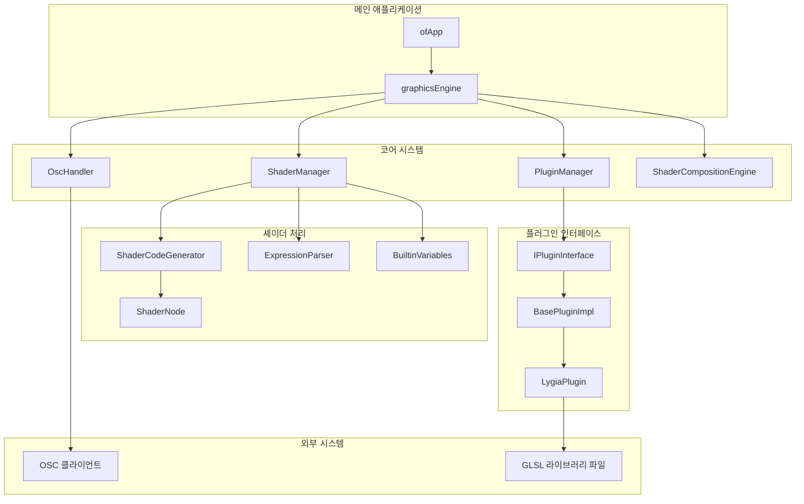

---

## 2. 코어 아키텍처

### 2.1 주요 구성 요소

#### 2.1.1 graphicsEngine (`src/geMain.h/cpp`)

모든 하위 시스템을 관리하는 중앙 오케스트레이터입니다. 통합된 인터페이스를 제공하기 위해 퍼사드 패턴을 구현합니다.

**주요 책임:**
- 플러그인 생명주기 관리
- 셰이더 시스템 초기화
- OSC 메시지 조정
- 원격 제어를 위한 셰이더 ID 관리

**상태 관리:**
```cpp
// 코어 매니저
std::unique_ptr<PluginManager> plugin_manager;
std::unique_ptr<ShaderManager> shader_manager;
std::unique_ptr<ShaderCompositionEngine> composition_engine;
std::unique_ptr<OscHandler> osc_handler;

// 셰이더 추적
std::shared_ptr<ShaderNode> current_shader;
std::map<std::string, std::shared_ptr<ShaderNode>> active_shaders;
```

#### 2.1.2 ofApp (`src/ofApp.h/cpp`)

그래픽 컨텍스트와 이벤트 처리를 제공하는 OpenFrameworks 애플리케이션 래퍼입니다.

**핵심 기능:**
- 초기화 시퀀스 조정
- 실시간 렌더링 루프
- 사용자 입력 처리
- 그래픽 캔버스 관리

### 2.2 초기화 시퀀스

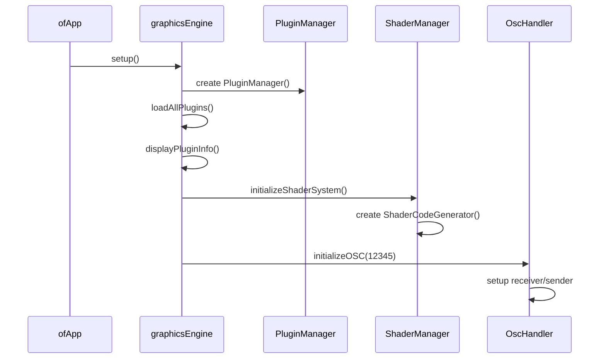

### 2.3 런타임 루프

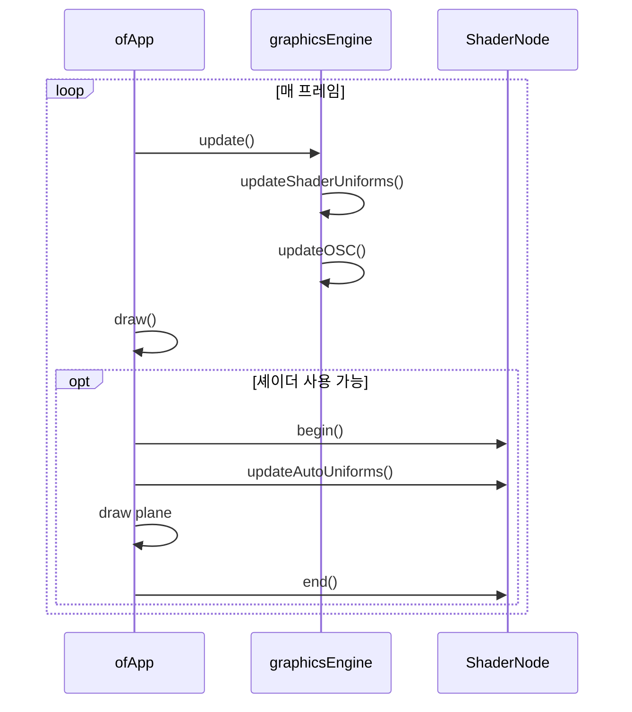

---

## 3. 플러그인 시스템

### 3.1 아키텍처 개요

플러그인 시스템은 동적 라이브러리 로딩을 사용하여 모듈식 GLSL 함수 컬렉션을 제공합니다.

#### 3.1.1 PluginManager (`src/pluginSystem/PluginManager.h/cpp`)

동적 라이브러리 생명주기 및 함수 검색을 처리합니다.

**핵심 작업:**
- `dlopen()`을 통한 동적 라이브러리 로딩
- ABI 버전 호환성 검사
- 함수 메타데이터 캐싱
- GLSL 내장 함수 충돌 감지

**플러그인 검색 프로세스:**
```cpp
// 파일 스캐닝
std::vector<std::string> findPluginFiles() {
    // data/plugins/ 에서 .so 파일 스캔
    // 모든 유효한 플러그인의 절대 경로 반환
}

// 로딩 시퀀스
bool loadPlugin(const std::string& plugin_path, const std::string& alias) {
    void* handle = dlopen(plugin_path.c_str(), RTLD_LAZY);
    // ABI 버전 확인
    // 심볼 확인 (createPlugin, destroyPlugin, getPluginInfo)
    // 인스턴스 생성 및 경로 설정
}
```

#### 3.1.2 LoadedPlugin 구조체

RAII 정리를 포함하는 내부 플러그인 표현:

```cpp
struct LoadedPlugin {
    void* handle;               // dlopen 핸들
    IPluginInterface* interface; // 플러그인 인스턴스
    std::string name, version, author, path;
    
    ~LoadedPlugin() {
        // destroyPlugin() 함수를 통한 자동 정리
        // dlclose()를 통한 라이브러리 핸들 닫기
    }
};
```

### 3.2 플러그인 인터페이스

#### 3.2.1 IPluginInterface (`glsl-plugin-interface/include/IPluginInterface.h`)

모든 플러그인을 위한 표준 인터페이스:

```cpp
class IPluginInterface {
public:
    virtual const char* getName() const = 0;
    virtual const GLSLFunction* findFunction(const std::string& name) const = 0;
    virtual std::vector<std::string> getAllFunctionNames() const = 0;
    virtual std::vector<std::string> getFunctionsByCategory(const std::string& category) const = 0;
    virtual void setPath(const std::string& path) = 0;
};
```

#### 3.2.2 C ABI 호환성

플러그인 로딩은 교차 컴파일러 호환성을 위해 C 링키지를 사용합니다:

```cpp
extern "C" {
    int getPluginABIVersion() { return PLUGIN_ABI_VERSION; }
    IPluginInterface* createPlugin() { return new LygiaPlugin(); }
    void destroyPlugin(IPluginInterface* plugin) { delete plugin; }
    const char* getPluginInfo() { return "Plugin metadata"; }
}
```

### 3.3 함수 메타데이터 시스템

#### 3.3.1 GLSLFunction 구조체

함수 정의는 완전한 시그니처 정보를 포함합니다:

```cpp
struct GLSLFunction {
    std::string name;
    std::string category;
    std::string description;
    std::string filePath;               // .glsl 파일의 상대 경로
    std::vector<FunctionOverload> overloads;
};

struct FunctionOverload {
    std::string returnType;             // GLSL 반환 타입
    std::vector<std::string> paramNames;
    std::vector<std::string> paramTypes; // GLSL 파라미터 타입
    std::string signature;              // 사람이 읽을 수 있는 시그니처
};
```

#### 3.3.2 내장 함수 충돌 감지

시스템은 GLSL 내장 함수와의 이름 충돌을 감지합니다:

```cpp
// MinimalBuiltinChecker는 GLSL 명세에 대해 유효성을 검사합니다
bool hasBuiltinConflict(const std::string& function_name) const;

// 충돌하는 함수에 대한 런타임 경고
void logRuntimeConflictWarning(const std::string& function_name, 
                              const std::string& plugin_name) const;
```

---

## 4. 셰이더 시스템

### 4.1 ShaderManager (`src/shaderSystem/ShaderManager.h/cpp`)

생성, 캐싱, 생명주기 관리를 처리하는 중앙 셰이더 오케스트레이터입니다.

#### 4.1.1 핵심 워크플로우

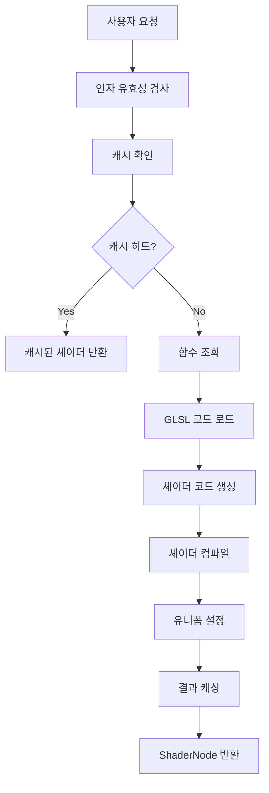

#### 4.1.2 캐싱 시스템

키 생성을 통한 성능 최적화 캐싱:

```cpp
class ShaderManager {
private:
    // 함수-인자 조합 캐시
    std::unordered_map<std::string, std::shared_ptr<ShaderNode>> shader_cache;
    
    // ID 기반 활성 셰이더 관리
    std::unordered_map<std::string, std::shared_ptr<ShaderNode>> active_shaders;
    
public:
    std::string generateCacheKey(const std::string& function_name, 
                                const std::vector<std::string>& arguments);
};
```

### 4.2 ShaderNode (`src/shaderSystem/ShaderNode.h/cpp`)

포괄적인 상태 관리를 갖춘 개별 셰이더 인스턴스입니다.

#### 4.2.1 상태 머신

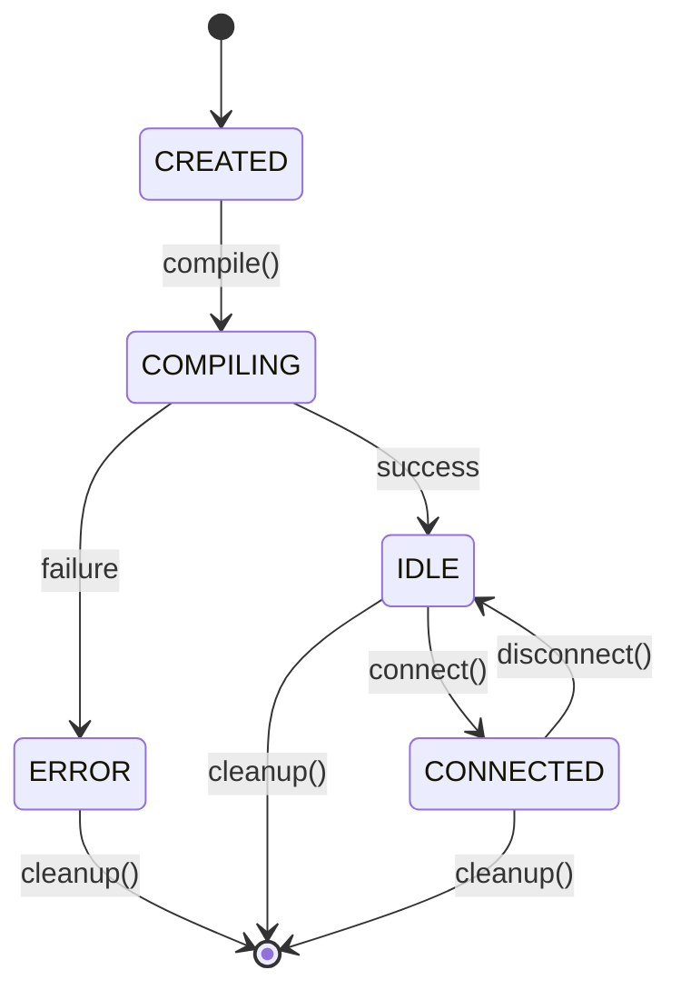

#### 4.2.2 유니폼 관리

자동 및 수동 유니폼 처리:

```cpp
class ShaderNode {
    // 자동 유니폼 (매 프레임 업데이트)
    bool auto_update_time;
    bool auto_update_resolution;
    
    // 사용자 정의 유니폼
    std::map<std::string, float> float_uniforms;
    std::map<std::string, ofVec2f> vec2_uniforms;
    
    void updateAutoUniforms() {
        if (auto_update_time)
            compiled_shader.setUniform1f("time", ofGetElapsedTimef());
        if (auto_update_resolution)
            compiled_shader.setUniform2f("resolution", ofGetWidth(), ofGetHeight());
    }
};
```

### 4.3 ShaderCodeGenerator (`src/shaderSystem/ShaderCodeGenerator.h/cpp`)

표현식 통합을 갖춘 템플릿 기반 셰이더 코드 생성기입니다.

#### 4.3.1 코드 생성 파이프라인

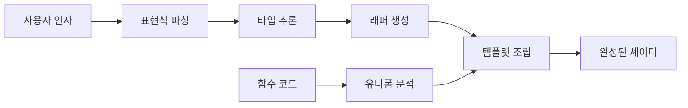

#### 4.3.2 템플릿 구조

```glsl
// 플레이스홀더를 포함한 프래그먼트 셰이더 템플릿
#version 330
uniform float time;
uniform vec2 resolution;

/*FUNCTION_CODE_PLACEHOLDER*/
/*WRAPPER_FUNCTION_PLACEHOLDER*/

void main() {
    /*VARIABLE_DECLARATIONS_PLACEHOLDER*/
    /*MAIN_FUNCTION_CALL_PLACEHOLDER*/
}
```

### 4.4 래퍼 함수 시스템

#### 4.4.1 자동 시그니처 적응

시스템은 사용자 인자를 함수 시그니처에 맞게 조정하기 위해 래퍼 함수를 생성합니다:

```glsl
// 원본 함수: float snoise(vec2)
// 사용자 호출: snoise(time, st.x)
// 생성된 래퍼:
float snoise(float arg0, float arg1) {
    return snoise(vec2(arg0, arg1));
}
```

#### 4.4.2 최적 오버로드 선택

함수 오버로드 선택 알고리즘:

```cpp
const FunctionOverload* findBestOverload(
    const GLSLFunction* function_metadata,
    const std::vector<std::string>& user_arguments) {
    
    // 1. 사용자 인자로부터 총 컴포넌트 수 계산
    // 2. 단일 벡터 파라미터에 대한 정확한 일치 찾기
    // 3. 다중 파라미터 시그니처에 대한 정확한 일치 찾기
    // 4. 가장 가까운 컴포넌트 수 일치로 폴백
}
```

---

## 5. 표현식 시스템

### 5.1 ExpressionParser (`src/shaderSystem/ExpressionParser.h/cpp`)

muParser 라이브러리를 사용하여 GLSL 출력을 포함한 수학적 표현식을 파싱합니다.

#### 5.1.1 표현식 처리 파이프라인

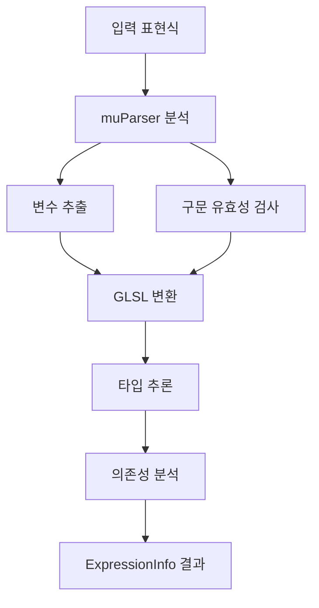

#### 5.1.2 표현식 타입

```cpp
struct ExpressionInfo {
    std::string original;           // "sin(time*0.1)"
    std::string glsl_code;         // "sin(time*0.1)"
    std::string type;              // "float"
    std::vector<std::string> dependencies; // ["time"]
    bool is_simple_var;            // false
    bool is_constant;              // false
    double constant_value;         // 0.0
};
```

### 5.2 BuiltinVariables (`src/shaderSystem/BuiltinVariables.h/cpp`)

스위즐(swizzle)을 지원하는 셰이더 내장 변수를 관리하는 싱글톤입니다.

#### 5.2.1 변수 정의

```cpp
void initializeBuiltins() {
    builtins["st"] = BuiltinVariable(
        "st", "vec2", 2,           // 이름, 타입, 컴포넌트 수
        true, true,                // 유니폼 필요, 선언 필요
        "vec2 st = gl_FragCoord.xy / resolution;"
    );
    
    builtins["time"] = BuiltinVariable(
        "time", "float", 1,
        true, false, ""            // 유니폼만, 선언 없음
    );
}
```

#### 5.2.2 스위즐 유효성 검사

```cpp
bool isValidSwizzle(const std::string& variable, std::string& errorMessage) {
    // 예시: "st.x", "st.xy", "resolution.y"
    std::string baseVar = extractBaseVariable(variable); // "st"
    std::string swizzle = extractSwizzle(variable);      // "xy"
    
    // 컴포넌트 수에 대해 유효성 검사
    const BuiltinVariable* info = getBuiltinInfo(baseVar);
    std::string validComponents = getSupportedSwizzleComponents(baseVar);
    
    // 각 스위즐 문자 확인
    for (char c : swizzle) {
        if (validComponents.find(c) == std::string::npos) {
            errorMessage = "유효하지 않은 스위즐...";
            return false;
        }
    }
    return true;
}
```

---

## 6. OSC 통신

### 6.1 OscHandler (`src/oscHandler/oscHandler.h/cpp`)

원격 셰이더 제어를 위한 OSC 메시지 처리.

#### 6.1.1 메시지 타입

```cpp
// 셰이더 노드 생성
struct OscCreateMessage {
    std::string function_name;      // "snoise"
    std::string raw_arguments;      // "time,st.x,1.0"
    bool is_valid_format;
    std::string format_error;
};

// 셰이더를 출력에 연결
struct OscConnectMessage {
    std::string shader_id;          // "shader_001"
    bool is_valid_format;
    std::string format_error;
};

// 셰이더 메모리 해제
struct OscFreeMessage {
    std::string shader_id;          // "shader_001"
    bool is_valid_format;
    std::string format_error;
};
```

#### 6.1.2 메시지 처리 흐름

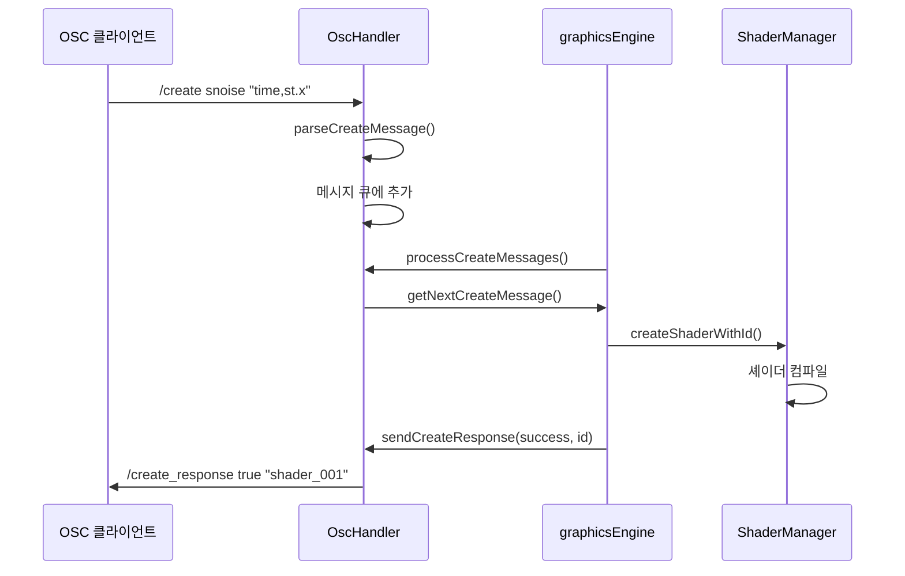

### 6.2 명령어 프로토콜

| 명령어 | 파라미터 | 응답 | 설명 |
|---------|------------|----------|-------------|
| `/create` | `function_name` `"arg1,arg2,..."` | `/create_response` `success` `shader_id` | 함수로부터 셰이더 생성 |
| `/connect` | `shader_id` | `/connect_response` `success` `message` | 셰이더를 출력에 연결 |
| `/free` | `shader_id` | `/free_response` `success` `message` | 셰이더 메모리 해제 |

---

## 7. 컴포지션 엔진

### 7.1 ShaderCompositionEngine (`src/shaderSystem/ShaderCompositionEngine.h/cpp`)

셰이더 그래프 최적화를 위한 고급 지연 컴파일 시스템입니다.

#### 7.1.1 노드 기반 아키텍처

```cpp
struct CompositionNode {
    std::string function_name;                    // "blur"
    std::vector<std::string> arguments;           // ["$shader_001", "0.1"]
    std::vector<CompositionNode*> input_nodes;    // 의존성
    std::string node_id;                         // "node_002"
    std::vector<std::string> resolved_arguments;  // ["texture_sample", "0.1"]
    bool is_external_dependency;
};
```

#### 7.1.2 지연 컴파일 프로세스

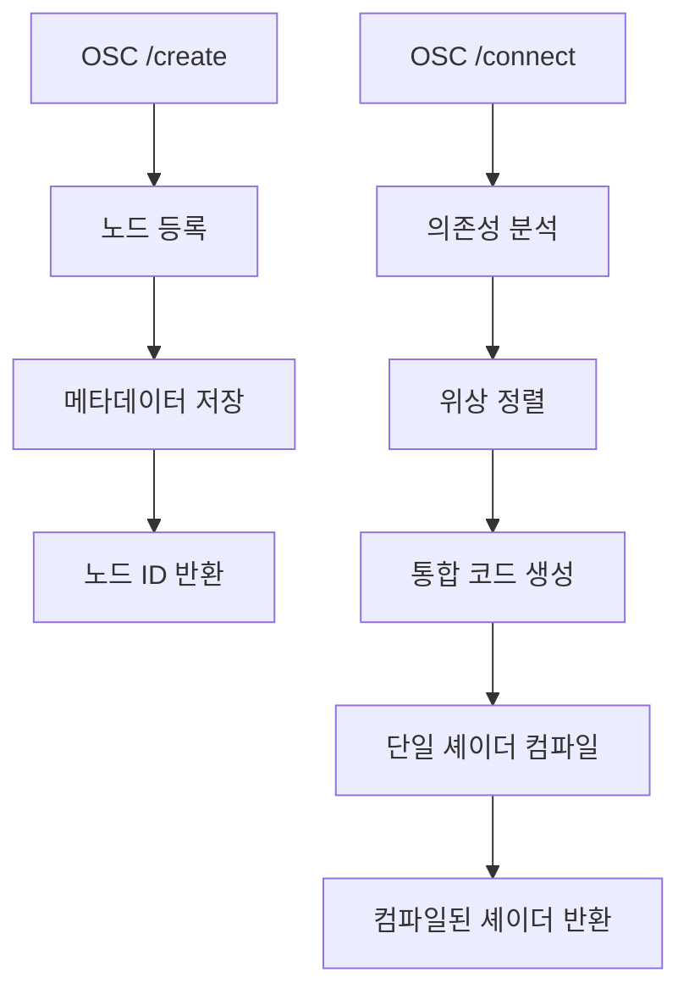

#### 7.1.3 그래프 분석 알고리즘

```cpp
bool topologicalSort(const std::string& output_node_id, 
                    std::vector<std::string>& sorted_nodes) {
    std::unordered_map<std::string, bool> visited;
    std::unordered_map<std::string, bool> rec_stack;
    
    return topologicalSortDFS(output_node_id, visited, rec_stack, sorted_nodes);
}

bool topologicalSortDFS(const std::string& node_id,
                       std::unordered_map<std::string, bool>& visited,
                       std::unordered_map<std::string, bool>& rec_stack,
                       std::vector<std::string>& sorted_nodes) {
    // 순환 감지 및 의존성 순서 지정
    if (rec_stack[node_id]) return false; // 순환 의존성
    if (visited[node_id]) return true;     // 이미 처리됨
    
    visited[node_id] = true;
    rec_stack[node_id] = true;
    
    // 재귀적으로 의존성 방문
    // 역위상 정렬 순서로 정렬된 목록에 추가
}
```

---

## 8. 데이터 흐름 분석

### 8.1 셰이더 생성 흐름

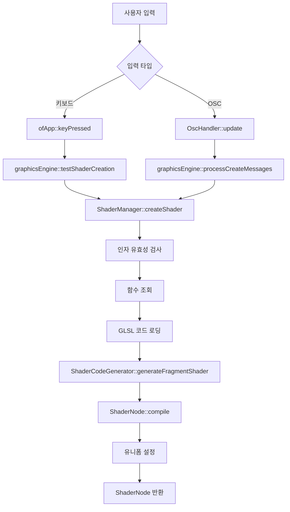

### 8.2 플러그인 로딩 흐름

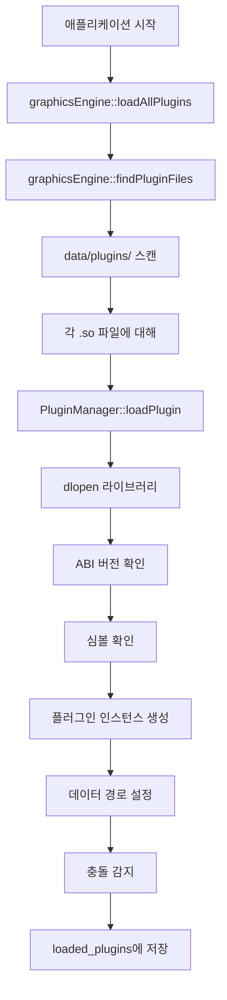

### 8.3 유니폼 업데이트 흐름

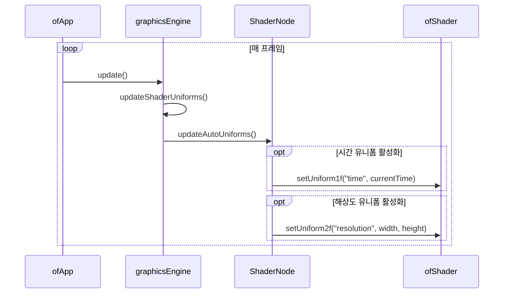

---

## 9. 성능 특성

### 9.1 메모리 관리

#### 9.1.1 RAII 패턴 구현

모든 주요 구성 요소는 자동 리소스 정리를 위해 RAII를 사용합니다:

```cpp
// ShaderNode 소멸자
~ShaderNode() {
    cleanup(); // 자동 OpenGL 리소스 정리
}

// LoadedPlugin 소멸자
~LoadedPlugin() {
    if (interface && handle) {
        destroy_plugin_t destroy_plugin = (destroy_plugin_t) dlsym(handle, "destroyPlugin");
        if (destroy_plugin) destroy_plugin(interface);
        dlclose(handle);
    }
}
```

#### 9.1.2 스마트 포인터 사용

스마트 포인터의 일관된 사용으로 메모리 누수를 방지합니다:

```cpp
// 고유 소유권
std::unique_ptr<PluginManager> plugin_manager;
std::unique_ptr<ShaderManager> shader_manager;

// 셰이더 노드를 위한 공유 소유권
std::shared_ptr<ShaderNode> current_shader;
std::map<std::string, std::shared_ptr<ShaderNode>> active_shaders;
```

### 9.2 캐싱 성능

#### 9.2.1 O(1) 조회 성능

상수 시간 셰이더 검색을 위한 해시 기반 캐싱:

```cpp
// 함수 + 인자 조합 키
std::string generateCacheKey(const std::string& function_name, 
                            const std::vector<std::string>& arguments) {
    std::string key = function_name;
    for (const auto& arg : arguments) {
        key += "_" + arg;
    }
    return key;
}
```

#### 9.2.2 플러그인 함수 검색

모든 플러그인에 걸쳐 O(1) 함수 조회:

```cpp
const GLSLFunction* findFunction(const std::string& function_name) {
    for (const auto& [alias, plugin] : loaded_plugins) {
        if (const GLSLFunction* func = plugin->interface->findFunction(function_name)) {
            return func; // 첫 번째 일치 항목이 이김
        }
    }
    return nullptr;
}
```

### 9.3 컴파일 최적화

#### 9.3.1 분할 컴파일 전략

대규모 플러그인 라이브러리(635개 함수)를 여러 컴파일 유닛으로 분할:
- `LygiaPlugin_Part1.cpp` 부터 `LygiaPlugin_Part13.cpp` 까지
- 병렬 컴파일로 빌드 시간을 약 10분에서 약 2분으로 단축
- 컴파일 유닛에 걸쳐 메모리 사용량 분산

#### 9.3.2 템플릿 캐싱

반복적인 문자열 작업을 피하기 위해 초기화 시 셰이더 템플릿을 캐싱합니다:

```cpp
class ShaderCodeGenerator {
private:
    std::string default_vertex_shader;           // 캐시된 템플릿
    std::string default_fragment_shader_template; // 캐시된 템플릿
    
public:
    void initializeShaderTemplates() {
        // 템플릿을 한 번 로드하고 캐시
        default_vertex_shader = loadVertexTemplate();
        default_fragment_shader_template = loadFragmentTemplate();
    }
};
```

---

## 10. 오류 처리

### 10.1 오류 전파 전략

#### 10.1.1 계층적 오류 처리

컨텍스트를 보존하며 시스템 계층을 통해 오류를 전파합니다:

```cpp
// ShaderManager 레벨
std::shared_ptr<ShaderNode> createErrorShader(
    const std::string& function_name, 
    const std::vector<std::string>& arguments,
    const std::string& error_message) {
    
    auto error_shader = std::make_shared<ShaderNode>(function_name, arguments);
    error_shader->setError(error_message);
    return error_shader;
}

// ShaderNode 레벨
void setError(const std::string& error) {
    has_error = true;
    error_message = error;
    is_compiled = false;
    setState(ShaderNodeState::ERROR);
    ofLogError("ShaderNode") << "Error in shader '" << function_name << "': " << error;
}
```

### 10.2 유효성 검사 시스템

#### 10.2.1 인자 유효성 검사

셰이더 컴파일 전 다층적 유효성 검사:

```cpp
// 내장 변수 유효성 검사
BuiltinVariables& builtins = BuiltinVariables::getInstance();
for (const auto& arg : arguments) {
    std::string errorMessage;
    if (!builtins.isValidSwizzle(arg, errorMessage)) {
        return createErrorShader(function_name, arguments, errorMessage);
    }
}

// 표현식 유효성 검사 (복잡한 표현식)
if (builtins.isComplexExpression(arg)) {
    ExpressionParser temp_parser;
    ExpressionInfo expr_info = temp_parser.parseExpression(arg);
    // 표현식 파싱 성공 여부 검증
}
```

#### 10.2.2 플러그인 로딩 유효성 검사

로드 중 포괄적인 플러그인 유효성 검사:

```cpp
bool loadPlugin(const std::string& plugin_path, const std::string& alias) {
    // 1. 동적 라이브러리 로딩 확인
    void* handle = dlopen(plugin_path.c_str(), RTLD_LAZY);
    if (!handle) {
        std::cerr << "플러그인을 로드할 수 없습니다: " << dlerror() << std::endl;
        return false;
    }
    
    // 2. ABI 버전 호환성
    get_abi_version_t get_abi_version = (get_abi_version_t) dlsym(handle, "getPluginABIVersion");
    if (get_abi_version && get_abi_version() != PLUGIN_ABI_VERSION) {
        std::cerr << "플러그인 ABI 버전 불일치" << std::endl;
        dlclose(handle);
        return false;
    }
    
    // 3. 필수 심볼 유효성 검사
    if (!create_plugin || !get_info) {
        std::cerr << "유효하지 않은 플러그인 형식: 필수 심볼 누락" << std::endl;
        dlclose(handle);
        return false;
    }
    
    // 4. 인스턴스 생성 유효성 검사
    IPluginInterface* plugin = create_plugin();
    if (!plugin) {
        std::cerr << "플러그인 인스턴스 생성 실패" << std::endl;
        dlclose(handle);
        return false;
    }
}
```

### 10.3 OSC 오류 처리

#### 10.3.1 메시지 형식 유효성 검사

```cpp
OscCreateMessage parseCreateMessage(const ofxOscMessage& osc_message) {
    OscCreateMessage msg;
    
    if (osc_message.getNumArgs() != 2) {
        msg.is_valid_format = false;
        msg.format_error = "2개의 인자(function_name, arguments)가 필요합니다";
        return msg;
    }
    
    if (osc_message.getArgType(0) != OFXOSC_TYPE_STRING ||
        osc_message.getArgType(1) != OFXOSC_TYPE_STRING) {
        msg.is_valid_format = false;
        msg.format_error = "두 인자 모두 문자열이어야 합니다";
        return msg;
    }
    
    msg.function_name = osc_message.getArgAsString(0);
    msg.raw_arguments = osc_message.getArgAsString(1);
    msg.is_valid_format = true;
    return msg;
}
```

#### 10.3.2 응답 생성

모든 OSC 작업은 성공/실패 응답을 포함합니다:

```cpp
void processCreateMessages() {
    while (osc_handler->hasCreateMessage()) {
        auto msg = osc_handler->getNextCreateMessage();
        
        if (!msg.is_valid_format) {
            osc_handler->sendCreateResponse(false, msg.format_error);
            continue;
        }
        
        std::string shader_id = createShaderWithId(msg.function_name, args);
        
        if (!shader_id.empty()) {
            osc_handler->sendCreateResponse(true, "셰이더가 성공적으로 생성되었습니다", shader_id);
        } else {
            osc_handler->sendCreateResponse(false, "셰이더 생성에 실패했습니다");
        }
    }
}
```

---

## 결론

이 종합 기술 문서는 GLSL 플러그인 시스템의 모든 주요 구성 요소, 아키텍처 결정 및 구현 세부 사항을 다룹니다. 이 시스템은 성능, 확장성 및 개발자 경험에 중점을 둔 동적 셰이더 관리에 대한 정교한 접근 방식을 나타냅니다.

주요 아키텍처 강점:
- **모듈식 설계**: 관심사의 명확한 분리로 독립적인 개발 가능
- **성능 최적화**: 캐싱, RAII 및 스마트 컴파일 전략
- **견고한 오류 처리**: 다층적 유효성 검사 및 정상적인 기능 저하
- **확장 가능한 아키텍처**: 플러그인 시스템은 무제한의 함수 라이브러리 지원

이 시스템은 정적 GLSL 라이브러리를 실시간 그래픽 애플리케이션, 라이브 코딩 및 인터랙티브 미디어 시스템에 적합한 동적이고 원격 제어 가능한 셰이더 환경으로 성공적으로 변환합니다.
