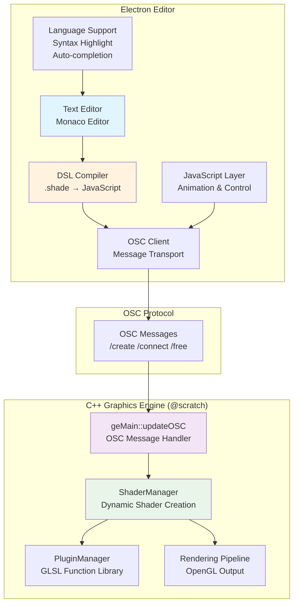
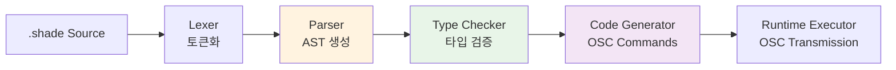

# Shader Live Coding Environment - Architecture Blueprint

**작성일**: 2025-08-19  
**프로젝트**: @scratch Graphics Engine  
**목표**: Electron 기반 셰이더 라이브 코딩 환경 구축

## 📋 Overview

현재 @scratch의 OSC 기반 동적 셰이더 시스템을 활용하여 실시간 셰이더 라이브 코딩 환경을 구축합니다. DSL(Domain Specific Language)과 JavaScript를 결합한 하이브리드 아키텍처로 직관적이면서도 강력한 셰이더 작성 환경을 제공합니다.

## 🏗️ System Architecture



## 🎯 DSL vs Pure JavaScript Analysis

### Fluent API를 고려한 재평가

**원래 가정**: DSL이 필수적이라고 생각했으나, Fluent API 스타일 JavaScript도 고려할 필요가 있음

#### Option 1: DSL Approach
```glsl
// DSL 방식
shader base = snoise(st, time);
shader result = base |> fbm(?, time * 0.1) |> mix(?, voronoi(st), 0.3);
connect(result);
```

#### Option 2: Fluent JavaScript API
```javascript
// Fluent API 방식
const base = shader.snoise(st, time);
const result = base
  .fbm(time.multiply(0.1))
  .mix(shader.voronoi(st), 0.3);
result.connect();

// 또는 더 간결하게
shader
  .snoise(st, time)
  .fbm(time.multiply(0.1))
  .mix(shader.voronoi(st), 0.3)
  .connect();
```

### 비판적 비교 분석

| Aspect | DSL Approach | Fluent JavaScript | **승자** |
|--------|--------------|-------------------|----------|
| **가독성** | `\|>` 연산자는 직관적 | `.chain()` 스타일도 직관적 | 🤝 **동등** |
| **학습 곡선** | 새로운 문법 학습 필요 | 기존 JS 지식 활용 | 🏆 **JavaScript** |
| **개발 속도** | 파서/컴파일러 구현 필요 | 즉시 구현 가능 | 🏆 **JavaScript** |
| **디버깅** | 커스텀 디버거 필요 | 브라우저 DevTools 활용 | 🏆 **JavaScript** |
| **IDE 지원** | 커스텀 언어 서버 필요 | TypeScript 지원 즉시 활용 | 🏆 **JavaScript** |
| **타입 안전성** | 커스텀 타입 체커 필요 | TypeScript로 해결 | 🏆 **JavaScript** |
| **확장성** | 문법 추가 시 파서 수정 | 새로운 메서드 추가만으로 확장 | 🏆 **JavaScript** |
| **에러 처리** | 컴파일 타임 + 런타임 | 런타임 위주이지만 TS로 보완 | 🤝 **비슷함** |
| **라이브 코딩 속도** | 간결한 문법 | 자동완성 지원 우수 | 🤝 **비슷함** |
| **GLSL 유사성** | 더 GLSL스러움 | JS 스타일 | 🏆 **DSL** |

### 🚨 **DSL 접근법의 치명적 단점들**

1. **개발 복잡성 폭증**
   - 파서, 컴파일러, 타입 체커 모두 직접 구현
   - 문법 오류 시 디버깅 도구 부재
   - 언어 서버 프로토콜 구현 필요

2. **유지보수 부담**
   - 문법 변경 시 파서 전체 수정 필요
   - 에러 메시지 품질 보장 어려움
   - 새로운 GLSL 함수 추가 시 문법 확장 필요

3. **생태계 단절**
   - 기존 JavaScript 도구 체인 활용 불가
   - npm 패키지 직접 사용 불가능
   - 커뮤니티 지원 부족

### 🎯 **결론: Fluent JavaScript API 채택**

**재평가 결과**: Fluent API 스타일 JavaScript가 더 실용적이고 효율적임

**최종 권장 아키텍처**: **Pure JavaScript + TypeScript + Fluent API**

## 🔧 Fluent JavaScript API Design

### 핵심 설계 원칙

1. **Method Chaining**: 모든 셰이더 함수가 체인 가능
2. **Type Safety**: TypeScript로 컴파일 타임 타입 검증
3. **Lazy Evaluation**: 실제 컴파일은 `.compile()` 또는 `.connect()` 호출 시
4. **Immutable Chains**: 각 체인은 새로운 객체 반환

### JavaScript Fluent API Syntax

```javascript
// 1. 기본 셰이더 생성 및 체이닝
const noise = shader
  .snoise(st, time)
  .compile();

// 2. 복잡한 함수 체이닝
const complexPattern = shader
  .snoise(st, time)
  .fbm(time.multiply(0.1), 4.0)
  .mix(shader.voronoi(st.multiply(2.0)), 0.3)
  .clamp(0.0, 1.0);

// 3. 변수 및 애니메이션 (JavaScript 네이티브)
const intensity = animate(0.1, 2.0, 3000); // Promise 기반
const offset = vec2(Math.sin(time.value), Math.cos(time.value));

// 4. 조건부 로직 (JavaScript 네이티브)
const result = time.value > 5.0 
  ? noise.mix(complexPattern, intensity)
  : noise.multiply(0.5);

// 5. 출력 연결
result.connect();

// 6. 이벤트 핸들링 (JavaScript 네이티브)
shader.onUpdate((ctx) => {
  console.log('Time:', ctx.time);
  console.log('Resolution:', ctx.resolution);
});
```

### TypeScript 타입 정의

```typescript
// 셰이더 체인 타입 정의
interface ShaderChain {
  // 노이즈 함수들
  snoise(pos: Vec2 | Vec3, time?: Float): ShaderChain;
  fbm(pos: Vec2 | Vec3, time?: Float, octaves?: Float): ShaderChain;
  voronoi(pos: Vec2 | Vec3, time?: Float): ShaderChain;
  curl(pos: Vec2 | Vec3, time?: Float): ShaderChain;
  
  // 수학 함수들
  mix(other: ShaderChain, factor: Float): ShaderChain;
  multiply(factor: Float | Vec2 | Vec3): ShaderChain;
  add(value: Float | Vec2 | Vec3 | ShaderChain): ShaderChain;
  clamp(min: Float, max: Float): ShaderChain;
  smoothstep(edge0: Float, edge1: Float): ShaderChain;
  
  // 변환 함수들
  scale(factor: Float | Vec2): ShaderChain;
  translate(offset: Vec2): ShaderChain;
  rotate(angle: Float): ShaderChain;
  
  // 출력 함수들
  compile(): Promise<CompiledShader>;
  connect(): Promise<string>; // 셰이더 ID 반환
  preview(): Promise<void>;   // 임시 프리뷰
  
  // 메타 정보
  getType(): ShaderType;
  getDependencies(): string[];
  clone(): ShaderChain;
}

// 기본 타입들
type Float = number | AnimatedFloat | ShaderExpression;
type Vec2 = [number, number] | ShaderExpression;
type Vec3 = [number, number, number] | ShaderExpression;
type Vec4 = [number, number, number, number] | ShaderExpression;

interface AnimatedFloat {
  readonly value: number;
  animate(from: number, to: number, duration: number): Promise<void>;
  oscillate(min: number, max: number, period: number): void;
}

// 내장 변수들
declare const st: Vec2;
declare const time: AnimatedFloat;
declare const resolution: Vec2;
declare const mouse: Vec2;
```

### Fluent API 구현 예시

```javascript
class ShaderChain {
  constructor(commands = [], type = 'float') {
    this.commands = commands;
    this.type = type;
    this.id = null;
  }

  // 노이즈 함수들
  snoise(pos, timeValue = time) {
    return new ShaderChain([
      ...this.commands,
      { type: 'function', name: 'snoise', args: [pos, timeValue] }
    ], 'float');
  }

  fbm(timeValue = time, octaves = 4.0) {
    return new ShaderChain([
      ...this.commands,
      { type: 'function', name: 'fbm', args: [this, timeValue, octaves] }
    ], 'float');
  }

  mix(other, factor) {
    return new ShaderChain([
      ...this.commands,
      { type: 'function', name: 'mix', args: [this, other, factor] }
    ], this.type);
  }

  // 체인 컴파일 및 실행
  async compile() {
    const compiler = new FluentShaderCompiler();
    const result = await compiler.compile(this.commands);
    
    if (result.success) {
      this.id = result.shaderId;
      return new CompiledShader(result.shaderId);
    } else {
      throw new ShaderCompileError(result.error);
    }
  }

  async connect() {
    if (!this.id) {
      await this.compile();
    }
    
    const osc = OSCClient.getInstance();
    const result = await osc.connect(this.id);
    
    if (!result.success) {
      throw new ShaderRuntimeError(result.error);
    }
    
    return this.id;
  }

  // 메서드 체이닝을 위한 유틸리티
  clone() {
    return new ShaderChain([...this.commands], this.type);
  }
}

// 팩토리 함수
const shader = new ShaderChain();

// 내장 변수들
const st = new ShaderExpression('st', 'vec2');
const time = new AnimatedFloat('time');
const resolution = new ShaderExpression('resolution', 'vec2');

// 애니메이션 헬퍼
function animate(from, to, duration) {
  return new AnimatedFloat('custom', { from, to, duration });
}

function vec2(x, y) {
  return new ShaderExpression(`vec2(${x}, ${y})`, 'vec2');
}
```

### 컴파일러 구현 (단순화)

```javascript
class FluentShaderCompiler {
  async compile(commands) {
    try {
      // 1. 의존성 분석
      const dependencies = this.analyzeDependencies(commands);
      
      // 2. 함수 체인을 OSC 메시지로 변환
      const oscCommands = this.generateOSCCommands(commands);
      
      // 3. OSC 전송
      const osc = OSCClient.getInstance();
      const results = [];
      
      for (const cmd of oscCommands) {
        const result = await osc.sendCommand(cmd.address, cmd.args);
        results.push(result);
      }
      
      // 4. 최종 셰이더 ID 반환
      const finalResult = results[results.length - 1];
      return {
        success: true,
        shaderId: finalResult.shaderId,
        dependencies
      };
      
    } catch (error) {
      return {
        success: false,
        error: error.message
      };
    }
  }

  generateOSCCommands(commands) {
    const oscCommands = [];
    
    for (const cmd of commands) {
      if (cmd.type === 'function') {
        // 함수 호출을 /create 메시지로 변환
        const args = this.resolveArguments(cmd.args);
        oscCommands.push({
          address: '/create',
          args: [cmd.name, args.join(',')]
        });
      }
    }
    
    return oscCommands;
  }

  resolveArguments(args) {
    return args.map(arg => {
      if (typeof arg === 'number') return arg.toString();
      if (arg instanceof ShaderExpression) return arg.expression;
      if (arg instanceof ShaderChain) return `$${arg.tempId}`;
      return arg.toString();
    });
  }
}
```

## 📝 ~~DSL Syntax Design~~ (Deprecated)

~~DSL 방식은 구현 복잡성과 유지보수 부담 때문에 폐기됨~~

## 🛠️ Pure JavaScript Implementation

### 기본 문법 (`.shade` 파일)

```glsl
// 1. 기본 셰이더 정의
shader base = snoise(st, time);
shader complex = fbm(st * 2.0, time * 0.1, 4.0);

// 2. 함수 체이닝 (파이프라인 연산자)
shader processed = base 
  |> fbm(?, time * 0.1, 4.0)
  |> mix(?, voronoi(st * 2.0), 0.3);

// 3. 변수 및 애니메이션
uniform float intensity = animate(0.1, 2.0, 3000ms);
uniform vec2 offset = [sin(time), cos(time)];
uniform float threshold = 0.5;

// 4. 조건부 로직
if (time > 5.0) {
  shader output = mix(base, complex, intensity);
} else {
  shader output = base * threshold;
}

// 5. 출력 연결
connect(output);

// 6. 라이프사이클 훅
onUpdate(() => {
  log("Current time:", time);
  log("Intensity:", intensity);
});

// 7. 다중 출력 (미래 확장)
export shader background = base;
export shader foreground = complex;
```

### 고급 문법 예제

```glsl
// 복합 함수 정의
function customNoise(pos, t) {
  return snoise(pos, t) + fbm(pos * 2.0, t * 0.5) * 0.5;
}

// 조건부 셰이더 체이닝
shader result = base
  |> when(intensity > 0.5, fbm(?, time))
  |> mix(?, customNoise(st, time), 0.3)
  |> clamp(?, 0.0, 1.0);

// 루프 구조
for (int i = 0; i < 3; i++) {
  shader layer${i} = snoise(st * (i + 1), time + i * 0.1);
}

shader combined = mix(layer0, mix(layer1, layer2, 0.5), 0.7);
```

## 🔧 Implementation Architecture

### 1. DSL Compiler Structure



### 2. Core Components

#### DSL Compiler (`dsl-compiler.js`)

```javascript
class ShaderDSLCompiler {
  constructor() {
    this.lexer = new ShaderLexer();
    this.parser = new ShaderParser();
    this.typeChecker = new TypeChecker();
    this.codeGenerator = new OSCCodeGenerator();
  }

  async compile(source) {
    try {
      // 1. Lexical Analysis
      const tokens = this.lexer.tokenize(source);
      
      // 2. Syntax Analysis
      const ast = this.parser.parse(tokens);
      
      // 3. Semantic Analysis
      const typedAST = this.typeChecker.check(ast);
      
      // 4. Code Generation
      const oscCommands = this.codeGenerator.generate(typedAST);
      
      return {
        success: true,
        commands: oscCommands,
        ast: typedAST
      };
    } catch (error) {
      return {
        success: false,
        error: error.message,
        location: error.location
      };
    }
  }
}

// AST Node Types
const ASTNodeTypes = {
  SHADER_DECLARATION: 'shader_declaration',
  FUNCTION_CALL: 'function_call', 
  PIPE_OPERATOR: 'pipe_operator',
  CONNECT_STATEMENT: 'connect_statement',
  UNIFORM_DECLARATION: 'uniform_declaration',
  ANIMATE_EXPRESSION: 'animate_expression',
  CONDITIONAL: 'conditional'
};

// Type System
const ShaderTypes = {
  FLOAT: 'float',
  VEC2: 'vec2', 
  VEC3: 'vec3',
  VEC4: 'vec4',
  SHADER: 'shader'
};
```

#### OSC Client (`osc-client.js`)

```javascript
class OSCClient {
  constructor(config = {}) {
    this.host = config.host || 'localhost';
    this.sendPort = config.sendPort || 12345;
    this.receivePort = config.receivePort || 54321;
    this.timeout = config.timeout || 5000;
    
    this.setupOSCPort();
  }

  setupOSCPort() {
    this.port = new osc.UDPPort({
      localAddress: "0.0.0.0",
      localPort: this.receivePort,
      remoteAddress: this.host,
      remotePort: this.sendPort
    });
    
    this.port.open();
    this.setupMessageHandlers();
  }

  async sendCommand(address, args = []) {
    return new Promise((resolve, reject) => {
      const timeoutId = setTimeout(() => {
        reject(new Error(`OSC timeout for ${address}`));
      }, this.timeout);

      // 응답 리스너 설정
      const responseHandler = (msg) => {
        if (msg.address === `${address}/response`) {
          clearTimeout(timeoutId);
          this.port.off('message', responseHandler);
          
          const success = msg.args[0].value === 'success';
          const message = msg.args[1].value;
          const shaderId = msg.args[2]?.value;
          
          resolve({ success, message, shaderId });
        }
      };

      this.port.on('message', responseHandler);

      // 메시지 전송
      this.port.send({
        address,
        args: args.map(arg => ({ type: 's', value: arg }))
      });
    });
  }

  async createShader(functionName, args) {
    const result = await this.sendCommand('/create', [functionName, args.join(',')]);
    return result;
  }

  async connectShader(shaderId) {
    const result = await this.sendCommand('/connect', [shaderId]);
    return result;
  }

  async freeShader(shaderId) {
    const result = await this.sendCommand('/free', [shaderId]);
    return result;
  }
}
```

#### Shader Live Engine (`shader-live-engine.js`)

```javascript
class ShaderLiveEngine {
  constructor() {
    this.osc = new OSCClient();
    this.compiler = new ShaderDSLCompiler();
    this.shaderManager = new ShaderStateManager();
    this.animationEngine = new AnimationEngine();
  }

  async compileAndRun(source) {
    try {
      // 1. DSL 컴파일
      const compiled = await this.compiler.compile(source);
      if (!compiled.success) {
        return compiled;
      }

      // 2. 기존 셰이더들 정리
      await this.shaderManager.cleanup();

      // 3. 새로운 셰이더들 실행
      const executionResult = await this.executeCommands(compiled.commands);

      // 4. 애니메이션 시작
      this.animationEngine.start(compiled.ast);

      return {
        success: true,
        shaderIds: executionResult.shaderIds,
        connectedShader: executionResult.connectedShader
      };
    } catch (error) {
      return {
        success: false,
        error: error.message
      };
    }
  }

  async executeCommands(commands) {
    const shaderIds = [];
    let connectedShader = null;

    for (const command of commands) {
      switch (command.type) {
        case 'create':
          const result = await this.osc.createShader(command.function, command.args);
          if (result.success) {
            shaderIds.push(result.shaderId);
            this.shaderManager.registerShader(command.name, result.shaderId);
          }
          break;

        case 'connect':
          const shaderId = this.shaderManager.getShaderIdByName(command.shaderName);
          const connectResult = await this.osc.connectShader(shaderId);
          if (connectResult.success) {
            connectedShader = shaderId;
          }
          break;
      }
    }

    return { shaderIds, connectedShader };
  }
}
```

### 3. Electron Editor Integration

#### Monaco Editor Setup (`editor.js`)

```javascript
class ShaderEditor {
  constructor() {
    this.engine = new ShaderLiveEngine();
    this.setupEditor();
    this.setupLanguageSupport();
    this.setupKeybindings();
  }

  setupEditor() {
    this.editor = monaco.editor.create(document.getElementById('editor'), {
      value: this.getDefaultShaderCode(),
      language: 'shader-dsl',
      theme: 'shader-dark-theme',
      fontSize: 14,
      minimap: { enabled: false },
      scrollBeyondLastLine: false,
      automaticLayout: true
    });
  }

  setupLanguageSupport() {
    // 언어 등록
    monaco.languages.register({ id: 'shader-dsl' });

    // 문법 하이라이팅
    monaco.languages.setMonarchTokensProvider('shader-dsl', {
      tokenizer: {
        root: [
          // 키워드
          [/\b(shader|uniform|connect|animate|if|else|for|function|export)\b/, 'keyword'],
          
          // GLSL 함수들
          [/\b(snoise|fbm|voronoi|curl|worley|gnoise|cnoise|mix|clamp|smoothstep)\b/, 'function'],
          
          // 내장 변수
          [/\b(st|time|resolution)\b/, 'builtin'],
          
          // 타입
          [/\b(float|vec2|vec3|vec4|int|bool)\b/, 'type'],
          
          // 숫자
          [/\d*\.\d+([eE][\-+]?\d+)?/, 'number.float'],
          [/\d+/, 'number'],
          
          // 문자열
          [/"([^"\\]|\\.)*$/, 'string.invalid'],
          [/"/, 'string', '@string'],
          
          // 연산자
          [/\|>/, 'operator.pipe'],
          [/[=!<>]=?/, 'operator.comparison'],
          [/[+\-*\/]/, 'operator.arithmetic'],
        ],
        
        string: [
          [/[^\\"]+/, 'string'],
          [/\\./, 'string.escape.invalid'],
          [/"/, 'string', '@pop']
        ]
      }
    });

    // 자동완성
    monaco.languages.registerCompletionItemProvider('shader-dsl', {
      provideCompletionItems: (model, position) => {
        const word = model.getWordUntilPosition(position);
        const range = {
          startLineNumber: position.lineNumber,
          endLineNumber: position.lineNumber,
          startColumn: word.startColumn,
          endColumn: word.endColumn
        };

        return {
          suggestions: [
            {
              label: 'snoise',
              kind: monaco.languages.CompletionItemKind.Function,
              insertText: 'snoise(${1:st}, ${2:time})',
              insertTextRules: monaco.languages.CompletionItemInsertTextRule.InsertAsSnippet,
              documentation: 'Simplex noise function',
              range: range
            },
            {
              label: 'fbm',
              kind: monaco.languages.CompletionItemKind.Function,
              insertText: 'fbm(${1:st}, ${2:time}, ${3:octaves})',
              insertTextRules: monaco.languages.CompletionItemInsertTextRule.InsertAsSnippet,
              documentation: 'Fractal Brownian Motion',
              range: range
            },
            {
              label: 'shader',
              kind: monaco.languages.CompletionItemKind.Keyword,
              insertText: 'shader ${1:name} = ${2:function}(${3:args});',
              insertTextRules: monaco.languages.CompletionItemInsertTextRule.InsertAsSnippet,
              documentation: 'Declare a new shader',
              range: range
            },
            {
              label: 'connect',
              kind: monaco.languages.CompletionItemKind.Keyword,
              insertText: 'connect(${1:shaderName});',
              insertTextRules: monaco.languages.CompletionItemInsertTextRule.InsertAsSnippet,
              documentation: 'Connect shader to output',
              range: range
            }
          ]
        };
      }
    });

    // 에러 마커
    monaco.languages.registerCodeLensProvider('shader-dsl', {
      provideCodeLenses: (model) => {
        return {
          lenses: [
            {
              range: {
                startLineNumber: 1,
                startColumn: 1,
                endLineNumber: 1,
                endColumn: 1
              },
              command: {
                id: 'compile-shader',
                title: '▶ Compile & Run (Ctrl+Enter)'
              }
            }
          ],
          dispose: () => {}
        };
      }
    });
  }

  setupKeybindings() {
    // Ctrl+Enter: 컴파일 및 실행
    this.editor.addCommand(monaco.KeyMod.CtrlCmd | monaco.KeyCode.Enter, async () => {
      await this.compileAndRun();
    });

    // Ctrl+S: 저장
    this.editor.addCommand(monaco.KeyMod.CtrlCmd | monaco.KeyCode.KeyS, () => {
      this.saveFile();
    });

    // Ctrl+Shift+C: OSC 연결 테스트
    this.editor.addCommand(monaco.KeyMod.CtrlCmd | monaco.KeyMod.Shift | monaco.KeyCode.KeyC, () => {
      this.testOSCConnection();
    });
  }

  async compileAndRun() {
    const code = this.editor.getValue();
    this.showStatus('🔄 Compiling...', 'info');

    const result = await this.engine.compileAndRun(code);

    if (result.success) {
      this.showStatus(`✅ Compiled successfully (Shaders: ${result.shaderIds.length})`, 'success');
      this.clearErrorMarkers();
    } else {
      this.showStatus(`❌ Compilation Error: ${result.error}`, 'error');
      this.showErrorInEditor(result.error, result.location);
    }
  }

  getDefaultShaderCode() {
    return `// Simple noise example
shader noise = snoise(st, time);
connect(noise);

// Animated FBM example  
// uniform float intensity = animate(0.1, 2.0, 3000ms);
// shader fbm_pattern = fbm(st * 2.0, time * 0.1, 4.0);
// shader mixed = mix(noise, fbm_pattern, intensity);
// connect(mixed);
`;
  }
}
```

## 🚀 Revised Implementation Roadmap (Fluent API)

### Phase 1: Core API Foundation (1-2 weeks) 🎯

```mermaid
gantt
    title Fluent API Shader Editor Development (Simplified)
    dateFormat  X
    axisFormat %s

    section Phase 1: Core API (1-2 weeks)
    Fluent API Classes     :active, p1a, 0, 4
    OSC Communication      :p1b, 2, 6
    Basic Electron Shell   :p1c, 4, 8
    
    section Phase 2: Editor Integration (1-2 weeks)  
    Monaco TypeScript      :p2a, 6, 10
    Auto-completion        :p2b, 8, 12
    Error Handling         :p2c, 10, 14
    
    section Phase 3: Live Features (1 week)
    Hot Compilation        :p3a, 12, 16
    Animation Engine       :p3b, 14, 18
    State Management       :p3c, 16, 20
    
    section Phase 4: Polish (1 week)
    Performance Opt        :p4a, 18, 22
    Documentation          :p4b, 20, 24
    Testing & Debugging    :p4c, 22, 26
```



#### Week 1: Core Fluent API 🔧
- [ ] **ShaderChain Class**: 기본 체이닝 인프라
- [ ] **OSC Client**: C++ 엔진과의 안정적 통신  
- [ ] **TypeScript Types**: 완전한 타입 정의
- [ ] **Basic Functions**: snoise, fbm, mix 등 핵심 함수들

#### Week 2: Electron + Monaco 📝
- [ ] **Electron Setup**: 기본 에디터 윈도우
- [ ] **Monaco TypeScript**: TS 지원 및 IntelliSense
- [ ] **Fluent API Integration**: 라이브러리 임포트 및 전역 변수
- [ ] **Basic Compilation**: `shader.snoise(st, time).connect()`

### Phase 2: Advanced Features (1-2 weeks)

#### Week 3: Enhanced API 🚀
- [ ] **Animation System**: `animate()` 함수 및 시간 기반 값들
- [ ] **Complex Chaining**: 중첩된 체인과 분기 처리
- [ ] **Error Handling**: Promise 기반 에러 처리
- [ ] **Type Safety**: 런타임 타입 검증

#### Week 4: Editor Polish ✨  
- [ ] **Auto-completion**: 메서드 체이닝 자동완성
- [ ] **Error Display**: TypeScript 에러 표시
- [ ] **Hot Reload**: 코드 변경 즉시 반영
- [ ] **Keybinding**: Ctrl+Enter 실행 등

### Phase 3: Production Ready (1 week)

#### Week 5: Optimization & Polish 🔧
- [ ] **Performance**: 대용량 체인 최적화
- [ ] **State Management**: 다중 셰이더 관리
- [ ] **Documentation**: API 문서 및 예제
- [ ] **Testing**: 유닛 테스트 및 E2E 테스트

### 🎯 Simplified Benefits

| Feature | DSL (14주) | Fluent API (5주) | 시간 절약 |
|---------|------------|------------------|-----------|
| **Parser/Compiler** | 4주 | 0주 | ✅ **4주** |
| **Type System** | 3주 | 1주 | ✅ **2주** |  
| **IDE Support** | 3주 | 0주 | ✅ **3주** |
| **Error Handling** | 2주 | 1주 | ✅ **1주** |
| **Testing** | 2주 | 1주 | ✅ **1주** |
| **총 개발 기간** | **14주** | **5주** | ✅ **9주 단축** |

## 📦 Revised Project Structure (Fluent API)

```
shader-live-editor/
├── package.json                     # TypeScript + Electron 설정
├── tsconfig.json                    # TypeScript 구성
├── main.ts                          # Electron 메인 프로세스 (TS)
├── preload.ts                       # 보안 컨텍스트 브리지
├── src/
│   ├── api/                         # 🔥 핵심 Fluent API
│   │   ├── shader-chain.ts          # 메인 ShaderChain 클래스
│   │   ├── types.ts                 # TypeScript 타입 정의
│   │   ├── builtin-variables.ts     # st, time, resolution 등
│   │   ├── animation.ts             # animate() 함수들
│   │   └── math-helpers.ts          # vec2, vec3 등 헬퍼 함수들
│   ├── osc/
│   │   ├── osc-client.ts           # OSC 통신 클라이언트
│   │   ├── message-types.ts        # OSC 메시지 타입 정의
│   │   └── fluent-compiler.ts      # Fluent → OSC 컴파일러
│   ├── engine/
│   │   ├── shader-state-manager.ts # 셰이더 상태 관리
│   │   └── animation-engine.ts     # 애니메이션 엔진
│   └── editor/
│       ├── monaco-setup.ts         # Monaco TypeScript 설정
│       ├── completion-provider.ts  # 자동완성 (Fluent API 기반)
│       ├── editor-ui.ts            # 에디터 UI 로직
│       └── keybindings.ts          # 키보드 단축키
├── renderer/
│   ├── index.html                  # 메인 에디터 UI
│   ├── styles/
│   │   ├── editor.css              # 에디터 스타일
│   │   └── themes/
│   │       ├── dark-theme.css
│   │       └── light-theme.css
│   └── main.ts                     # 렌더러 프로세스 엔트리
├── examples/                       # 🔥 JavaScript 파일들
│   ├── basic-noise.js             # shader.snoise(st, time).connect()
│   ├── animated-fbm.js            # 애니메이션 FBM 예제
│   ├── complex-composition.js     # 복합 체이닝 예제
│   └── interactive-controls.js    # 인터랙티브 제어
├── types/                          # 🔥 글로벌 타입 정의
│   ├── global.d.ts                # 전역 변수 타입 (shader, st, time)
│   └── fluent-api.d.ts            # Fluent API 타입 정의
├── docs/
│   ├── api-reference.md           # Fluent API 레퍼런스
│   ├── function-library.md        # 사용 가능한 함수들
│   └── typescript-guide.md        # TypeScript 사용 가이드
└── tests/
    ├── shader-chain.test.ts       # ShaderChain 클래스 테스트
    ├── osc-client.test.ts         # OSC 통신 테스트
    ├── fluent-compiler.test.ts    # Fluent 컴파일러 테스트
    └── integration.test.ts        # 통합 테스트
```

### 🎯 Key Structure Changes

1. **DSL 관련 제거**: `dsl/` 디렉토리 완전 삭제
2. **TypeScript 우선**: 모든 `.js` → `.ts` 전환
3. **Fluent API 중심**: `api/` 디렉토리가 핵심
4. **단순화된 구조**: 파일 수 대폭 감소 (30+ → 20개 미만)

## 🎯 Success Metrics

### Technical Goals
- [ ] **컴파일 속도**: <100ms for typical shaders
- [ ] **OSC 지연시간**: <50ms round-trip
- [ ] **메모리 사용량**: <200MB for editor + runtime
- [ ] **에러 감지율**: >95% compile-time error detection

### User Experience Goals
- [ ] **학습 시간**: <30분 for basic shader creation
- [ ] **편집 효율성**: 키보드 중심 workflow
- [ ] **실시간성**: Live feedback within 100ms
- [ ] **안정성**: >99% uptime during live sessions

## 🔄 Integration with @scratch

### Current OSC Messages
```javascript
// 현재 지원되는 OSC 메시지들
const OSC_MESSAGES = {
  CREATE: '/create',    // 셰이더 생성
  CONNECT: '/connect',  // 출력 연결  
  FREE: '/free'         // 메모리 해제
};

// 응답 메시지 형식
const OSC_RESPONSES = {
  CREATE: '/create/response',   // [status, message, shader_id]
  CONNECT: '/connect/response', // [status, message] 
  FREE: '/free/response'        // [status, message]
};
```

### Future Extensions
```javascript
// 향후 추가 예정 OSC 메시지들
const FUTURE_OSC_MESSAGES = {
  LIST: '/list',           // 활성 셰이더 목록
  UPDATE: '/update',       // 셰이더 파라미터 업데이트
  SNAPSHOT: '/snapshot',   // 현재 상태 저장
  RESTORE: '/restore'      // 상태 복원
};
```

## 🏁 Getting Started

### Immediate Next Steps (Week 1)

1. **프로젝트 초기화**
   ```bash
   mkdir shader-live-editor
   cd shader-live-editor
   npm init -y
   npm install electron monaco-editor osc-js
   npm install --save-dev @electron/rebuild electron-builder
   ```

2. **기본 Electron 앱 생성**
   - `main.js`: Electron 메인 프로세스
   - `index.html`: Monaco Editor 통합
   - `package.json`: 스크립트 및 의존성

3. **최소 DSL 컴파일러**
   - 기본 토큰 인식 (shader, connect, 함수명)
   - 간단한 AST 생성
   - OSC 메시지 생성

4. **OSC 통신 테스트**
   - @scratch와의 연결 확인
   - 기본 /create 메시지 전송
   - 응답 메시지 수신 검증

### First Milestone: Basic Working Editor
```glsl
// 목표: 이 코드가 정상 작동하는 에디터
shader noise = snoise(st, time);
connect(noise);
```

이 청사진을 바탕으로 강력하고 직관적인 셰이더 라이브 코딩 환경을 단계적으로 구축할 수 있습니다. DSL의 표현력과 JavaScript의 유연성을 결합하여 @scratch 시스템의 잠재력을 최대한 활용하는 도구가 될 것입니다.