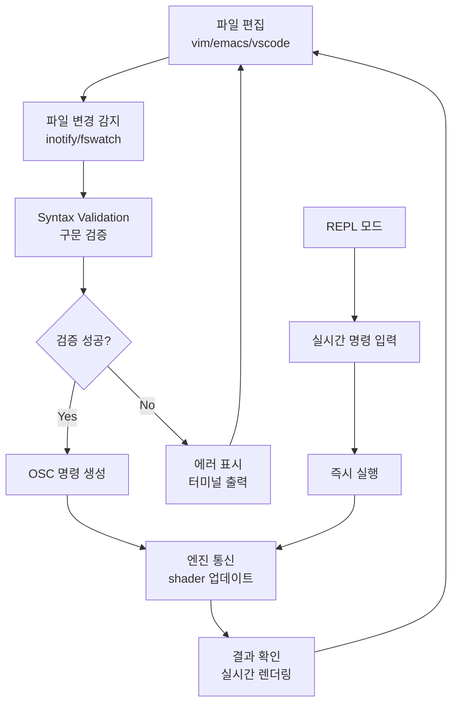

# CLI Shader Script Interpreter 설계 문서

## 개요

기존의 Electron 기반 에디터 접근법을 대체하여, **CLI 기반의 Shader Script Interpreter**를 구현함으로써 에디터 의존성을 완전히 제거하고 universal access를 제공하는 혁신적인 아키텍처를 제안한다.

## 문제 정의

### 기존 Electron 에디터 방식의 한계

1. **Environmental Lock-in**
   - GUI 환경 필수 요구
   - SSH/tty 환경에서 사용 불가
   - 헤드리스 서버 환경 지원 불가

2. **Development Overhead**
   - 200MB+ 메모리 사용량
   - Node.js/Electron 의존성 관리
   - 크로스 플랫폼 빌드 복잡성

3. **Integration Barriers**
   - CI/CD 파이프라인 통합 어려움
   - 스크립팅 및 자동화 제약
   - 배치 처리 불가능

## 해결책: CLI Shader Script Interpreter

### 핵심 개념

**Shader Script Interpreter**: 텍스트 기반의 shader scripting 언어(.shsl)를 파싱하여 C++ 엔진과 OSC 통신을 수행하는 명령줄 도구

### 명명법

- **CLI Tool**: `glsl-runner`
- **Script Language**: `.shsl` (Shader Script Language)
- **Runtime**: GLSL Scripting Runtime
- **Mode**: Live Coding Engine

## 아키텍처 설계

### 1. Shader Scripting Language (.shsl) 문법

```glsl
// =============================================================================
// Variable Definition & Import System
// =============================================================================

@import lygia.noise    // 플러그인 import
@import lygia.math

// 전역 변수 정의
$speed = 0.1
$complexity = 5.0
$colors = [vec3(1.0, 0.2, 0.1), vec3(0.1, 0.4, 1.0)]

// =============================================================================
// Shader Chain Definition
// =============================================================================

// 기본 셰이더 정의
shader noise_base = snoise(st * $complexity, time * $speed);

// 파이프라인 체이닝
shader processed = noise_base
    .pipe(smoothstep(0.2, 0.8))
    .pipe(mix($colors[0], $colors[1]));

// 복합 셰이더 정의
shader fbm_layer = fbm(st * 2.0, time * 0.05);
shader final_output = blend(processed, fbm_layer, 0.5);

// =============================================================================
// Control Flow & Logic
// =============================================================================

// 조건부 실행
if (time > 10.0) {
    shader new_pattern = curl(st * 8.0, time * 0.2);
    crossfade(final_output, new_pattern, 2.0);
}

// 루프 구조
for (i in range(5)) {
    shader layer_${i} = perlin(st * pow(2, i), time);
    blend_add(final_output, layer_${i}, 0.1);
}

// =============================================================================
// Output Management
// =============================================================================

// 출력 연결
connect final_output to output;

// 조건부 출력 전환
switch (time % 20.0) {
    case 0..5: connect noise_base to output;
    case 5..10: connect processed to output;
    case 10..15: connect fbm_layer to output;
    default: connect final_output to output;
}

// =============================================================================
// Live Parameter Control
// =============================================================================

// 실시간 파라미터 바인딩
live_params {
    speed: $speed -> "noise_speed"
    colors: $colors -> "color_palette"
    mix_factor: 0.5 -> "blend_amount"
}

// 키보드 입력 바인딩 (REPL 모드)
bind {
    'q': $speed *= 1.1
    'a': $speed *= 0.9
    'w': $complexity += 1.0
    's': $complexity -= 1.0
}
```

### 2. CLI Interface 설계

#### 기본 명령어 구조
```bash
# =============================================================================
# Basic Execution Modes
# =============================================================================

# 단일 스크립트 실행
glsl-runner script.shsl

# 라이브 코딩 모드 (파일 감시)
glsl-runner --watch script.shsl
glsl-runner -w script.shsl

# 인터랙티브 REPL 모드
glsl-runner --interactive
glsl-runner -i

# =============================================================================
# Batch Processing & Automation
# =============================================================================

# 배치 모드 (다중 파일 처리)
glsl-runner --batch shaders/*.shsl --output rendered/
glsl-runner -b shaders/ -o output/

# 프레임 렌더링 모드
glsl-runner --render script.shsl --frames 1000 --fps 60 --output frames/

# 검증 모드 (구문 검사만)
glsl-runner --validate --dry-run script.shsl
glsl-runner -v --dry script.shsl

# =============================================================================
# Debug & Development
# =============================================================================

# 디버그 모드
glsl-runner --debug --verbose script.shsl
glsl-runner -dv script.shsl

# 성능 프로파일링
glsl-runner --profile --benchmark script.shsl

# OSC 메시지 로깅
glsl-runner --osc-log --trace script.shsl

# =============================================================================
# Plugin Management
# =============================================================================

# 플러그인 정보 조회
glsl-runner --list-plugins
glsl-runner --plugin-info lygia
glsl-runner --function-help snoise

# 플러그인 동적 로딩
glsl-runner --load-plugin /path/to/plugin.so script.shsl

# =============================================================================
# Configuration & Setup
# =============================================================================

# 엔진 연결 설정
glsl-runner --engine-host localhost --engine-port 12345 script.shsl

# 설정 파일 사용
glsl-runner --config ~/.glsl-runner.toml script.shsl
```

#### 설정 파일 (.glsl-runner.toml)
```toml
[engine]
host = "localhost"
port = 12345
response_port = 54321
timeout = 5000

[runtime]
auto_reload = true
error_recovery = true
verbose_logging = false

[live_coding]
watch_interval = 100  # ms
hot_reload = true
preserve_state = true

[output]
default_format = "png"
frame_rate = 60
resolution = [1920, 1080]

[plugins]
auto_discover = true
search_paths = [
    "/usr/local/lib/glsl-plugins",
    "~/.glsl-plugins",
    "./plugins"
]
```

### 3. Live Coding Workflow

#### 실시간 개발 사이클


#### Hot Reload 시스템
```bash
# 파일 변경 감지 예시
$ glsl-runner --watch --hot-reload shader.shsl

[2025-08-19 15:30:45] ✓ Watching shader.shsl for changes...
[2025-08-19 15:30:45] ✓ Connected to engine localhost:12345
[2025-08-19 15:30:45] ✓ Shader loaded successfully (ID: sha_001)

[File Changed] shader.shsl
[2025-08-19 15:31:02] ⟳ Reloading...
[2025-08-19 15:31:02] ✓ Syntax validated
[2025-08-19 15:31:02] ✓ Shader updated (ID: sha_001)
[2025-08-19 15:31:02] ⚡ Hot reload completed (45ms)

[File Changed] shader.shsl  
[2025-08-19 15:31:15] ⟳ Reloading...
[2025-08-19 15:31:15] ✗ Syntax Error: line 23: unknown function 'invalid_func'
[2025-08-19 15:31:15] ⚠  Previous shader state preserved
```

### 4. Interactive REPL Mode

```bash
$ glsl-runner --interactive

GLSL Runner Interactive Mode v1.0.0
Connected to engine: localhost:12345
Available plugins: lygia, custom_noise

glsl> create noise = snoise(st, time * 0.1)
✓ Shader created (ID: noise_001)

glsl> connect noise to output
✓ Connected to output

glsl> modify noise.time_mult = 0.5
✓ Parameter updated

glsl> show active
Active Shaders:
- noise_001: snoise(st, time * 0.5) [connected]

glsl> create fbm = fbm(st * 5.0, time)
✓ Shader created (ID: fbm_002)

glsl> blend noise fbm 0.3
✓ Blend operation executed

glsl> save current as "my_composition.shsl"
✓ Saved to my_composition.shsl

glsl> help
Available Commands:
  create <name> = <expression>  - Create new shader
  connect <shader> to output    - Connect shader to output
  modify <shader>.<param> = <val> - Modify shader parameter
  blend <s1> <s2> <factor>      - Blend two shaders
  show <active|plugins|help>    - Display information
  save <current|name> as <file> - Save current state
  load <file>                   - Load shader script
  quit                          - Exit REPL

glsl> quit
✓ Goodbye!
```

## 구현 로드맵

### Phase 1: Core Infrastructure (2주)

#### Week 1: Parser & Basic Runtime
```cpp
// 주요 컴포넌트
class ShaderScriptParser {
    AST parse(const std::string& script);
    std::vector<OSCCommand> generateCommands(const AST& ast);
    bool validate(const AST& ast);
};

class OSCClient {
    bool connect(const std::string& host, int port);
    bool sendCommand(const OSCCommand& cmd);
    Response waitForResponse(int timeout_ms);
};

class ScriptRuntime {
    void execute(const std::string& script_file);
    void setWatchMode(bool enabled);
    void setInteractiveMode(bool enabled);
};
```

#### Week 2: Command Line Interface
```cpp
// CLI 프론트엔드
class CLIApplication {
    void parseArguments(int argc, char** argv);
    void runBatchMode(const std::vector<std::string>& files);
    void runWatchMode(const std::string& file);
    void runInteractiveMode();
    void displayHelp();
};
```

### Phase 2: Live Coding Features (1주)

#### File Watching System
```cpp
class FileWatcher {
    void watchFile(const std::string& path, 
                   std::function<void()> callback);
    void setWatchInterval(int ms);
    bool isFileChanged(const std::string& path);
};

class HotReloadManager {
    void enableHotReload();
    void preserveShaderState();
    void recoverFromError();
    void displayReloadStatus();
};
```

### Phase 3: Advanced Features (1주)

#### Interactive REPL
```cpp
class REPLInterface {
    void startSession();
    void executeCommand(const std::string& cmd);
    void displayPrompt();
    void showHelp();
    void saveSession(const std::string& filename);
};

class ParameterBinding {
    void bindKeyboard(char key, const std::string& action);
    void updateLiveParameter(const std::string& name, float value);
    void setupLiveControls();
};
```

## 비교 분석: CLI vs Electron

| 측면 | CLI Interpreter | Electron Editor |
|------|----------------|-----------------|
| **환경 지원** | ✅ Universal (SSH, tty, GUI) | ❌ GUI만 지원 |
| **메모리 사용량** | ✅ ~10MB | ❌ ~200MB+ |
| **개발 복잡성** | ✅ 단순한 C++ 구현 | ❌ Node.js + UI 복잡성 |
| **자동화 지원** | ✅ 완벽한 스크립팅 | ❌ 제한적 |
| **에디터 자유도** | ✅ 모든 에디터 지원 | ❌ 내장 에디터만 |
| **원격 작업** | ✅ SSH 네이티브 지원 | ❌ X11 포워딩 필요 |
| **CI/CD 통합** | ✅ 쉬운 통합 | ❌ 어려움 |
| **라이브 코딩** | ✅ Hot reload 지원 | ✅ 동등한 기능 |
| **사용성** | ⚠️ CLI 학습 필요 | ✅ 직관적 GUI |
| **시각적 피드백** | ❌ 텍스트 기반 | ✅ 시각적 UI |

## 핵심 장점 요약

### 1. **True Universal Access**
- SSH를 통한 원격 shader 개발
- 헤드리스 서버에서 shader 자동화
- 라즈베리파이 등 경량 환경 지원

### 2. **Editor Philosophy**
```bash
# 개발자가 선호하는 워크플로우 유지
vim shader.shsl && glsl-runner --watch shader.shsl
emacs shader.shsl & glsl-runner -w shader.shsl
code shader.shsl  # VSCode + CLI 조합
```

### 3. **Automation & Integration**
```bash
# CI/CD 파이프라인 예시
#!/bin/bash
# shader-build.sh
for shader in src/*.shsl; do
    glsl-runner --validate "$shader" || exit 1
    glsl-runner --render "$shader" --frames 100 --output "build/"
done
```

### 4. **Performance & Simplicity**
- 단일 바이너리 배포
- 의존성 최소화
- 빠른 시작 시간 (<100ms)

## 결론

CLI Shader Script Interpreter는 Electron 에디터의 모든 기능을 제공하면서도:

1. **환경 제약 없음**: GUI, SSH, tty 어디서나 동작
2. **개발자 자유도**: 원하는 에디터와 워크플로우 사용
3. **시스템 통합성**: 스크립팅, 자동화, CI/CD 완벽 지원
4. **리소스 효율성**: 경량화된 실행 환경

특히 shader 개발의 특성상 **빠른 iteration**이 중요한데, CLI 환경에서 훨씬 더 효율적인 라이브 코딩 워크플로우를 제공할 수 있다.

**"Fancy UI" 대신 "True Power"를 선택하는 것이 올바른 방향이다.**

---

**작성일**: 2025년 8월 19일  
**버전**: 1.0  
**상태**: 구현 준비 완료