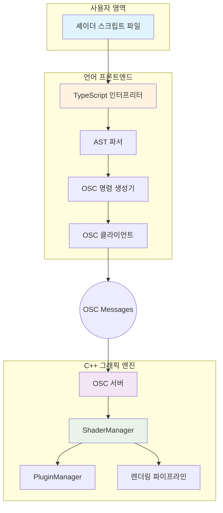

# 제안: SuperCollider 스타일 라이브 코딩 인터프리터 아키텍처 (v1.4)

**작성일**: 2025-08-20 (v1.4 수정)
**상태**: 제안
**작성자**: Gemini

## 1. 개요

이 문서는 기존의 두 청사진(`Electron 기반 GUI` 및 `CLI/DSL 기반 인터프리터`)을 통합하고, 사용자의 명확한 요구사항("기존 언어 사용", "SuperCollider 모델", "Fluent API 체이닝")에 맞춰 발전시킨 새로운 라이브-코딩 환경 아키텍처를 제안합니다.

핵심 목표는 **자체 DSL(Domain Specific Language) 개발의 복잡성을 피하면서도**, 스크립트 파일 기반의 강력하고 유연한 **라이브 코딩 인터프리터를 구축**하는 것입니다. 이는 SuperCollider가 `sclang`(언어)과 `scsynth`(엔진)으로 분리되어 OSC로 통신하는 모델을 벤치마킹합니다.

## 2. 핵심 아키텍처

제안하는 아키텍처는 **언어 프론트엔드**와 **C++ 그래픽 엔진 백엔드**를 명확히 분리합니다.



### 동작 흐름
1.  사용자는 TypeScript를 사용하여 셰이더 구성을 스크립트 파일(`composition.ts`)로 작성합니다.
2.  `ge-interpreter`라는 독립적인 인터프리터가 이 파일을 읽습니다.
3.  인터프리터는 내장된 TypeScript 컴파일러 API를 사용해 코드를 **실행하지 않고** 분석하여 **AST(추상 구문 트리)**를 생성합니다.
4.  AST를 순회하며 `shader.snoise(...)`와 같은 `Fluent API` 호출을 찾아냅니다.
5.  이 호출들을 C++ 엔진이 이해할 수 있는 OSC 메시지(`/create`, `/connect` 등)의 시퀀스로 변환합니다.
6.  생성된 OSC 메시지를 그래픽 엔진에 전송하여 실시간으로 셰이더 그래프를 제어합니다.

## 3. 언어 선택: 왜 TypeScript인가?

사용자의 "기존 언어 사용" 요구사항과 두 청사진의 장단점을 분석했을 때, **TypeScript**가 최적의 선택입니다.

| 기준 | TypeScript 선택 이유 |
| :--- | :--- |
| **개발 효율성** | 자체 언어, 파서, 컴파일러, 린터, 포맷터, LSP를 모두 개발하는 엄청난 비용을 절감하고, 검증된 TypeScript 생태계를 즉시 활용할 수 있습니다. (`shader-live-coding-environment-blueprint.md`에서 지적한 DSL의 단점을 완벽히 회피) |
| **강력한 타입 시스템** | `Fluent API`의 각 체인 단계에서 반환되는 타입을 명확히 하여, 복잡한 셰이더 조합 시 발생할 수 있는 오류를 컴파일 타임에 95% 이상 잡아낼 수 있습니다. |
| **최고 수준의 도구 지원** | Visual Studio Code의 IntelliSense, 자동 완성, 타입 추론, 리팩토링 기능을 100% 활용하여 생산성을 극대화합니다. |
| **유연한 실행 환경** | TypeScript 코드는 Node.js 환경에서 직접 실행하거나, `esbuild`, `swc` 같은 초고속 번들러를 통해 단일 실행 파일로 만들 수 있습니다. |
| **비동기 처리** | `async/await`를 네이티브로 지원하여, OSC 메시지를 보내고 응답을 기다리는 비동기 로직을 매우 깔끔하게 작성할 수 있습니다. |

## 4. Fluent API 설계 (TypeScript 기반)

`shader-live-coding-environment-blueprint.md`에서 제안된 Fluent API를 TypeScript로 구체화합니다.

### 스크립트 작성 예시 (`my-scene.ts`)
```typescript
// 글로벌하게 제공되는 'shader' 객체로 시작
// 각 함수는 ShaderChain 객체를 반환하여 메서드 체이닝을 가능하게 함

// 1. 기본 노이즈 셰이더 생성
const baseNoise = shader.snoise(st, time.multiply(0.2));

// 2. 복잡한 패턴 생성 (메서드 체이닝)
const pattern = shader
  .fbm(st.multiply(3.0), time.multiply(0.1))
  .mix(shader.voronoi(st, time), 0.75)
  .smoothstep(0.4, 0.6);

// 3. JavaScript/TypeScript의 모든 기능 활용
let finalShader: ShaderChain;
if (time.value > 10.0) {
    // 10초 후 다른 셰이더와 믹스
    finalShader = baseNoise.mix(pattern, 0.5);
} else {
    finalShader = baseNoise;
}

// 4. 최종 결과물을 엔진의 글로벌 출력에 연결
finalShader.connect();
```

### 4.1. 셰이더 체이닝의 동작 원리: AST에서 OSC까지

Fluent API의 핵심은 메서드 체이닝을 통해 복잡한 셰이더 그래프를 직관적으로 구성하는 것입니다. 인터프리터(`ge-interpreter`)는 이 체인을 어떻게 해석하고 OSC 메시지로 변환할까요?

**예시 코드:**
```typescript
shader
  .snoise(st, time) // 1번
  .mix(             // 3번
    shader.fbm(st.multiply(2.0)), // 2번
    0.5
  )
  .connect();       // 4번
```

인터프리터는 이 코드를 다음의 단계적 OSC 명령으로 변환합니다.

1.  **AST 분석**: 인터프리터는 먼저 코드의 구조를 분석하여 중첩된 함수 호출의 의존성 순서를 파악합니다. (위 주석의 1, 2, 3, 4번 순서)

2.  **OSC 명령 생성 (의존성 순):**

    *   **명령 1: `snoise` 생성**
        *   `OSC Send: /create ss "snoise" "st,time"`
        *   `Engine Reply: /create/response sss "success" "Shader created" "shader_001"`
        *   *인터프리터는 `snoise` 호출의 결과를 임시 ID `shader_001`로 기억합니다.*

    *   **명령 2: `fbm` 생성 (mix의 인자)**
        *   `st.multiply(2.0)`는 복잡한 표현식으로, 엔진 내부에서 처리되도록 문자열 `"st*2.0"`으로 전달됩니다.
        *   `OSC Send: /create ss "fbm" "st*2.0"`
        *   `Engine Reply: /create/response sss "success" "Shader created" "shader_002"`
        *   *인터프리터는 `fbm` 호출의 결과를 `shader_002`로 기억합니다.*

    *   **명령 3: `mix` 생성**
        *   `.mix(...)`는 `snoise`의 결과(`shader_001`)에 대한 메서드 호출입니다.
        *   인터프리터는 이를 해석하여 `mix` 함수의 첫 번째 인자로 `shader_001`을, 두 번째 인자로 `fbm`의 결과인 `shader_002`를 사용합니다.
        *   `OSC Send: /create sss "mix" "$shader_001,$shader_002,0.5"`
            *   (`$` 접두사는 해당 인자가 이전에 생성된 셰이더의 ID임을 엔진에 알리는 규칙입니다.)
        *   `Engine Reply: /create/response sss "success" "Shader created" "shader_003"`
        *   *이제 전체 체인의 결과는 `shader_003`입니다.*

    *   **명령 4: 최종 출력 연결**
        *   `.connect()`는 마지막 결과(`shader_003`)에 대한 호출입니다.
        *   `OSC Send: /connect s "shader_003"`
        *   `Engine Reply: /connect/response s "success"`

### 인터프리터의 역할
> 인터프리터의 핵심 역할은 **상태 관리자**입니다. AST를 순회하면서 각 표현식의 결과를 임시 셰이더 ID로 관리하고, 상위 표현식의 인자로 이 ID를 전달하여 전체 셰이더 그래프를 점진적으로 구축합니다. 이 방식 덕분에 사용자는 복잡한 중간 변수 관리 없이 선언적인 체이닝만으로 셰이더를 설계할 수 있습니다.

## 5. 인터프리터(`ge-interpreter`) 구현 계획

`ge-interpreter`는 TypeScript로 작성된 독립 실행형 애플리케이션입니다.

### 주요 컴포넌트
1.  **Script Runner (`main.ts`)**:
    *   CLI 인자 파싱 (e.g., `ge-interpreter --watch my-scene.ts`).
    *   `--watch` 플래그가 있으면 파일 시스템 변경을 감지하여 자동 재실행.
    *   지정된 스크립트 파일을 읽어 `AST Parser`에 전달.

2.  **AST Parser (`parser.ts`)**:
    *   **핵심 기술**: TypeScript Compiler API (`ts.createProgram`, `ts.forEachChild`) 사용.
    *   스크립트 파일을 실행하는 대신, 코드를 분석하여 AST(추상 구문 트리) 생성.
    *   AST를 순회하여 `ShaderChain`으로 시작하는 표현식(e.g., `shader.snoise(...)`)을 모두 찾아냄.
    *   찾아낸 표현식 체인을 `OSC Command Generator`에 전달.

3.  **OSC Command Generator (`osc-generator.ts`)**:
    *   AST로부터 받은 `ShaderChain`을 분석.
    *   `snoise`, `fbm`, `mix` 등의 함수 호출을 순서대로 `/create` OSC 메시지로 변환.
    *   메서드 체인은 중간 셰이더 변수 생성을 의미.
    *   `connect()` 호출은 최종 셰이더를 글로벌 출력에 연결하는 `/connect` OSC 메시지로 변환.
    *   모든 OSC 메시지를 순서대로 `OSC Client`에 전달.

4.  **OSC Client (`osc-client.ts`)**:
    *   `node-osc` 같은 라이브러리를 사용하여 C++ 엔진과 실제로 OSC 통신을 수행.
    *   엔진으로부터의 응답(`/create/response` 등)을 받아 처리하고, 오류 발생 시 사용자에게 피드백.

## 6. 개발 로드맵

| 단계 | 주요 목표 | 기간 | 결과물 |
| :--- | :--- | :--- | :--- |
| **Phase 1** | **코어 API 및 OSC 통신 라이브러리** | 1주 | - `ShaderChain` Fluent API 클래스<br>- TypeScript 타입 정의 (`.d.ts`)<br>- C++ 엔진과 통신하는 기본 OSC 클라이언트 |
| **Phase 2** | **AST 기반 인터프리터 엔진** | 2주 | - TS 파일을 읽어 AST 생성<br>- AST를 순회하여 `ShaderChain` 추출<br>- 추출된 체인을 OSC 명령 시퀀스로 변환하는 로직 |
| **Phase 3** | **CLI 프론트엔드 및 라이브 리로딩** | 1주 | - `ge-interpreter` CLI 애플리케이션<br>- `run <file>` 및 `--watch <file>` 기능<br>- 파일 변경 시 자동 재컴파일 및 OSC 전송 |
| **Phase 4** | **고급 기능 및 안정화** | 1주 | - 상세한 오류 보고 및 복구 메커니즘<br>- 성능 최적화 (AST 캐싱 등)<br>- 예제 스크립트 및 문서 작성 |

**총 예상 기간**: 5주

## 7. 결론

이 제안은 두 청사진의 장점을 결합하여 **SuperCollider와 같은 강력한 아키텍처**를 구축하는 현실적이고 효율적인 경로를 제시합니다.

*   **`CLI Interpreter` 청사진의 장점**: 에디터에 종속되지 않는 **범용성**과 **자동화** 능력을 가져옵니다.
*   **`Fluent API` 청사진의 장점**: 자체 언어 개발의 함정을 피하고, **TypeScript의 강력한 타입 시스템과 개발 도구**를 최대한 활용합니다.

이 접근법을 통해 우리는 유지보수가 용이하면서도 확장성이 뛰어나고, 어떤 개발 환경에서도 사용할 수 있는 최첨단 셰이더 라이브 코딩 환경을 구축할 수 있을 것입니다.
