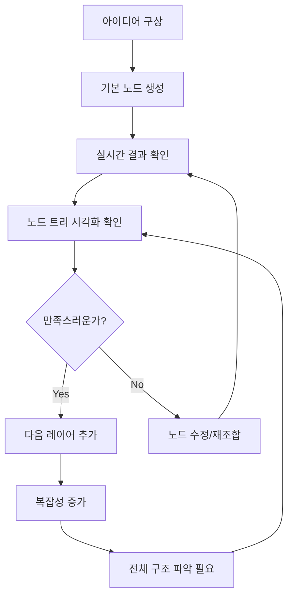

# 라이브 코딩을 위한 노드 트리 시각화 시스템

**작성일**: 2025-08-19 23:13:50  
**상태**: 설계 단계  
**작성자**: Claude Code  

## 1. 개요: 라이브 코딩 중심의 노드 트리 쿼리 시스템

이 문서는 **라이브 코딩 아티스트**가 실시간으로 셰이더 노드 트리를 시각화하고, 이를 기반으로 **직관적이고 효율적인 라이브 코딩 세션**을 조직할 수 있도록 하는 시스템의 구현 방안을 제시합니다.

### 1.1 핵심 목적

1. **🎨 라이브 코딩 시각화**: 클라이언트에서 실시간 노드 그래프 시각화
2. **🎯 창작 흐름 최적화**: 복잡한 셰이더 구조를 직관적으로 파악하여 창작 계획 수립
3. **🎭 퍼포먼스 지원**: 라이브 공연 중 시각적 피드백을 통한 즉흥 창작 지원
4. **🔄 실시간 협업**: 여러 아티스트가 동일한 노드 트리를 공유하며 협업

### 1.2 SuperCollider 모델과의 비교

**SuperCollider의 강점**:
- `s.plotTree`: 실시간 신시사이저 노드 트리 시각화
- `s.scope`: 실시간 오디오 파형 모니터링  
- `NodeWatcher`: 노드 생성/소멸 실시간 추적

**우리 시스템의 목표**:
- 셰이더 노드 그래프의 **실시간 시각적 표현**
- 라이브 코딩 세션 중 **창작 의도와 실제 결과의 즉각적 매칭**
- **시각적 피드백을 통한 직관적 셰이더 조합**

## 2. 라이브 코딩 아티스트의 요구사항 분석

### 2.1 라이브 코딩 세션의 전형적 워크플로우



### 2.2 클라이언트 시각화 요구사항

#### A. **실시간 그래프 뷰어**
```typescript
// 라이브 코딩 클라이언트에서 필요한 기능
interface LiveCodingVisualization {
  // 노드 그래프 실시간 업데이트
  updateNodeGraph(treeData: NodeTreeData): void;
  
  // 노드 하이라이팅 (현재 수정 중인 노드)
  highlightActiveNode(nodeId: string): void;
  
  // 데이터 플로우 애니메이션
  showDataFlow(fromNode: string, toNode: string): void;
  
  // 퍼포먼스 메트릭 오버레이
  showPerformanceOverlay(metrics: PerformanceData): void;
  
  // 빠른 노드 선택/수정
  enableQuickNodeEditing(nodeId: string): void;
}
```

#### B. **시각적 요소 설계**
- **노드 표현**: 함수명, 파라미터, 상태를 한눈에 파악 가능
- **연결선**: 데이터 플로우 방향과 의존성 명확 표시
- **상태 색상**: 컴파일 상태, 연결 상태, 오류 상태 구분
- **실시간 업데이트**: 최대 60fps로 부드러운 시각화

#### C. **인터랙션 디자인**
- **클릭-투-코드**: 노드 클릭시 해당 코드 라인으로 이동
- **드래그 앤 드롭**: 노드 재배치로 코딩 우선순위 조정
- **컨텍스트 메뉴**: 우클릭으로 노드 복제, 삭제, 수정
- **미니맵**: 큰 그래프의 전체 구조 빠른 파악

## 3. 라이브 코딩 최적화를 위한 JSON 구조 재설계

### 3.1 시각화 친화적 JSON 구조

```json
{
  "session_info": {
    "session_id": "live_session_20250819_231350",
    "timestamp": "2025-08-19T23:13:50.627Z",
    "artist_name": "live_coder_01",
    "session_duration_ms": 145000,
    "bpm": 128,
    "current_bar": 32
  },
  "visualization_data": {
    "layout_suggestion": {
      "algorithm": "hierarchical_dag",
      "node_positions": {
        "shader_001": {"x": 100, "y": 50, "layer": 0},
        "shader_002": {"x": 100, "y": 150, "layer": 0},
        "shader_003": {"x": 300, "y": 100, "layer": 1},
        "shader_004": {"x": 500, "y": 100, "layer": 2}
      },
      "suggested_viewport": {
        "center": {"x": 300, "y": 100},
        "zoom": 1.0,
        "rotation": 0
      }
    },
    "visual_styles": {
      "node_colors": {
        "noise": "#FF6B6B",
        "math": "#4ECDC4", 
        "color": "#45B7D1",
        "geometry": "#96CEB4"
      },
      "connection_styles": {
        "data_flow": {"color": "#FFA07A", "width": 2, "animated": true},
        "dependency": {"color": "#98D8C8", "width": 1, "dashed": true}
      }
    }
  },
  "nodes": {
    "shader_001": {
      "id": "shader_001",
      "display_name": "Base Noise",
      "function_name": "snoise",
      "category": "noise",
      "arguments": ["st", "time*0.2"],
      "live_coding_metadata": {
        "creation_order": 1,
        "last_modified": "2025-08-19T23:05:12.123Z",
        "modification_count": 3,
        "is_currently_editing": false,
        "performance_weight": 0.15,
        "artistic_notes": "Main rhythmic element"
      },
      "visual_properties": {
        "suggested_color": "#FF6B6B",
        "icon": "wave",
        "size": "medium",
        "opacity": 1.0
      },
      "runtime_info": {
        "status": "active",
        "compile_time_ms": 45,
        "memory_usage_kb": 256,
        "gpu_load_percent": 12,
        "last_execution_time_ms": 1.2
      },
      "connections": {
        "outputs": [
          {
            "target_node": "shader_003",
            "target_parameter": 0,
            "connection_strength": 1.0,
            "data_type": "float"
          }
        ],
        "inputs": []
      }
    },
    "shader_003": {
      "id": "shader_003",
      "display_name": "Noise Blend",
      "function_name": "mix",
      "category": "math",
      "arguments": ["$shader_001", "$shader_002", "0.5"],
      "live_coding_metadata": {
        "creation_order": 3,
        "last_modified": "2025-08-19T23:07:45.789Z",
        "modification_count": 7,
        "is_currently_editing": true,
        "performance_weight": 0.35,
        "artistic_notes": "Blend control for texture complexity"
      },
      "visual_properties": {
        "suggested_color": "#4ECDC4",
        "icon": "blend",
        "size": "large",
        "opacity": 1.0,
        "highlight": true
      },
      "runtime_info": {
        "status": "active",
        "compile_time_ms": 32,
        "memory_usage_kb": 512,
        "gpu_load_percent": 28,
        "last_execution_time_ms": 2.1
      },
      "connections": {
        "inputs": [
          {
            "source_node": "shader_001",
            "parameter_index": 0,
            "data_type": "float",
            "connection_strength": 1.0
          },
          {
            "source_node": "shader_002", 
            "parameter_index": 1,
            "data_type": "float",
            "connection_strength": 1.0
          }
        ],
        "outputs": [
          {
            "target_node": "shader_004",
            "target_parameter": 0,
            "connection_strength": 1.0,
            "data_type": "float"
          }
        ]
      }
    }
  },
  "performance_analysis": {
    "total_gpu_load_percent": 67,
    "bottleneck_nodes": ["shader_003", "shader_004"],
    "optimization_suggestions": [
      {
        "node_id": "shader_003",
        "suggestion": "Consider caching intermediate result",
        "potential_speedup": "15%"
      }
    ],
    "memory_distribution": {
      "total_usage_mb": 24.5,
      "per_node_breakdown": {
        "shader_001": 0.256,
        "shader_002": 0.512,
        "shader_003": 1.024,
        "shader_004": 2.048
      }
    }
  },
  "live_coding_session": {
    "timeline": [
      {
        "timestamp": "2025-08-19T23:05:12Z",
        "action": "create",
        "node_id": "shader_001",
        "description": "Added base noise layer"
      },
      {
        "timestamp": "2025-08-19T23:07:45Z", 
        "action": "modify",
        "node_id": "shader_003",
        "description": "Adjusted blend ratio from 0.3 to 0.5"
      }
    ],
    "current_focus": "shader_003",
    "suggested_next_actions": [
      "Add color mapping to shader_004",
      "Introduce temporal variation to shader_001",
      "Create feedback loop with new node"
    ],
    "collaboration_info": {
      "active_collaborators": ["artist_02", "vj_mixer_01"],
      "shared_nodes": ["shader_003", "shader_004"],
      "conflict_resolution": "latest_wins"
    }
  }
}
```

### 3.2 시각화 최적화를 위한 메타데이터

#### A. **레이아웃 힌트**
```json
{
  "layout_hints": {
    "grouping": {
      "noise_generators": ["shader_001", "shader_002"],
      "processors": ["shader_003"],
      "outputs": ["shader_004"]
    },
    "flow_direction": "left_to_right",
    "preferred_spacing": {
      "horizontal": 200,
      "vertical": 100
    },
    "cluster_detection": {
      "auto_group": true,
      "max_cluster_size": 5
    }
  }
}
```

#### B. **실시간 퍼포먼스 지표**
```json
{
  "realtime_metrics": {
    "frame_rate": 60,
    "frame_time_ms": 16.67,
    "gpu_utilization": 67,
    "memory_pressure": "low",
    "thermal_state": "normal",
    "predicted_performance": {
      "next_frame_time_ms": 17.2,
      "confidence": 0.85
    }
  }
}
```

## 4. 라이브 코딩 워크플로우 최적화

### 4.1 창작 과정 지원 기능

#### A. **스마트 노드 추천**
```json
{
  "smart_suggestions": {
    "based_on_current_context": {
      "context": "noise_mixing_pattern",
      "suggested_next_nodes": [
        {
          "function": "smoothstep",
          "reason": "Add smooth transitions to noise mix",
          "confidence": 0.8,
          "preview_available": true
        },
        {
          "function": "sin",
          "reason": "Add temporal oscillation",
          "confidence": 0.6,
          "preview_available": true
        }
      ]
    },
    "pattern_recognition": {
      "detected_pattern": "feedback_loop_setup",
      "completion_suggestions": [
        "Add delay buffer node",
        "Insert gain control",
        "Apply lowpass filter"
      ]
    }
  }
}
```

#### B. **창작 히스토리 추적**
```json
{
  "creative_history": {
    "decision_points": [
      {
        "timestamp": "2025-08-19T23:05:30Z",
        "action": "chose_snoise_over_fbm",
        "reasoning": "Better fit for rhythmic patterns",
        "alternatives_considered": ["fbm", "voronoi"],
        "outcome_satisfaction": 0.8
      }
    ],
    "creative_branches": [
      {
        "branch_name": "aggressive_distortion",
        "created_at": "2025-08-19T23:06:15Z",
        "nodes_snapshot": ["shader_001", "shader_002"],
        "quick_restore": true
      }
    ]
  }
}
```

### 4.2 실시간 협업 지원

#### A. **다중 아티스트 세션**
```json
{
  "collaboration_session": {
    "session_master": "artist_01",
    "participants": [
      {
        "name": "artist_02",
        "role": "shader_specialist", 
        "current_focus": "shader_003",
        "permissions": ["create", "modify_own", "suggest"],
        "active_since": "2025-08-19T23:10:00Z"
      },
      {
        "name": "vj_mixer",
        "role": "visual_mixer",
        "current_focus": "global_output",
        "permissions": ["connect", "disconnect", "monitor"],
        "active_since": "2025-08-19T23:12:00Z"
      }
    ],
    "real_time_cursors": {
      "artist_02": {
        "node_id": "shader_003",
        "parameter": "blend_ratio",
        "cursor_color": "#FF6B6B"
      }
    },
    "conflict_resolution": {
      "strategy": "operational_transform",
      "lock_timeout_ms": 5000,
      "merge_conflicts": []
    }
  }
}
```

#### B. **라이브 퍼포먼스 모드**
```json
{
  "performance_mode": {
    "enabled": true,
    "performance_presets": [
      {
        "name": "minimal_bass",
        "nodes": ["shader_001", "shader_003"],
        "hotkey": "F1",
        "transition_time_ms": 2000
      },
      {
        "name": "complex_buildup", 
        "nodes": ["shader_001", "shader_002", "shader_003", "shader_004"],
        "hotkey": "F2",
        "transition_time_ms": 4000
      }
    ],
    "live_controls": {
      "global_intensity": {
        "current_value": 0.7,
        "midi_cc": 1,
        "affects_nodes": ["shader_003", "shader_004"]
      },
      "noise_complexity": {
        "current_value": 0.45,
        "midi_cc": 2,
        "affects_nodes": ["shader_001", "shader_002"]
      }
    }
  }
}
```

## 5. 클라이언트 구현 예제

### 5.1 웹 기반 시각화 클라이언트

```typescript
// React + D3.js 기반 라이브 코딩 시각화
class LiveCodingNodeViewer extends React.Component {
  private d3Container = React.createRef<SVGSVGElement>();
  private simulation: d3.Simulation<NodeData, undefined>;
  
  componentDidMount() {
    this.setupOSCConnection();
    this.initializeVisualization();
    this.startRealTimeUpdates();
  }
  
  setupOSCConnection() {
    // WebSocket을 통한 OSC 브리지 연결
    this.oscBridge = new WebSocket('ws://localhost:8080/osc-bridge');
    this.oscBridge.onmessage = (event) => {
      const nodeTreeData = JSON.parse(event.data);
      this.updateVisualization(nodeTreeData);
    };
    
    // 주기적 쿼리 (60fps)
    setInterval(() => {
      this.sendOSCQuery('/query');
    }, 16); // ~60fps
  }
  
  updateVisualization(treeData: NodeTreeData) {
    const svg = d3.select(this.d3Container.current);
    
    // 노드 업데이트
    const nodes = svg.selectAll('.node')
      .data(treeData.nodes, d => d.id);
    
    // 새 노드 추가 (애니메이션)
    const nodeEnter = nodes.enter()
      .append('g')
      .attr('class', 'node')
      .style('opacity', 0)
      .transition()
      .duration(300)
      .style('opacity', 1);
    
    // 현재 편집 중인 노드 하이라이팅
    nodes.classed('editing', d => d.live_coding_metadata.is_currently_editing)
      .classed('bottleneck', d => treeData.performance_analysis.bottleneck_nodes.includes(d.id));
    
    // 데이터 플로우 애니메이션
    this.animateDataFlow(treeData.execution_graph);
  }
  
  animateDataFlow(executionGraph: ExecutionEdge[]) {
    executionGraph.forEach(edge => {
      const path = this.svg.select(`path[data-edge="${edge.from}-${edge.to}"]`);
      
      // 파티클 애니메이션으로 데이터 플로우 시각화
      path.append('circle')
        .attr('r', 3)
        .attr('fill', '#FFA07A')
        .transition()
        .duration(1000)
        .attrTween('transform', () => {
          return (t: number) => {
            const point = path.node().getPointAtLength(t * path.node().getTotalLength());
            return `translate(${point.x},${point.y})`;
          };
        })
        .remove();
    });
  }
  
  render() {
    return (
      <div className="live-coding-visualizer">
        <div className="controls">
          <button onClick={this.togglePerformanceMode}>
            Performance Mode: {this.state.performanceMode ? 'ON' : 'OFF'}
          </button>
          <div className="collaborators">
            {this.state.collaborators.map(collab => 
              <div key={collab.name} className="collaborator-badge">
                <span style={{color: collab.cursor_color}}>{collab.name}</span>
                <span className="status">{collab.current_focus}</span>
              </div>
            )}
          </div>
        </div>
        
        <svg ref={this.d3Container} className="node-graph">
          {/* D3.js가 여기에 동적으로 노드 그래프를 렌더링 */}
        </svg>
        
        <div className="side-panel">
          <div className="performance-metrics">
            <h3>Performance</h3>
            <div className="metric">
              <span>GPU Load:</span>
              <div className="progress-bar">
                <div style={{width: `${this.state.gpuLoad}%`}} />
              </div>
            </div>
            <div className="metric">
              <span>Frame Time:</span>
              <span>{this.state.frameTime}ms</span>
            </div>
          </div>
          
          <div className="suggestions">
            <h3>Smart Suggestions</h3>
            {this.state.suggestions.map(suggestion =>
              <div key={suggestion.function} className="suggestion">
                <button onClick={() => this.applySuggestion(suggestion)}>
                  {suggestion.function}
                </button>
                <span className="reason">{suggestion.reason}</span>
              </div>
            )}
          </div>
        </div>
      </div>
    );
  }
}
```

### 5.2 TouchDesigner 통합 예제

```python
# TouchDesigner에서 노드 트리 시각화
class TDLiveCodingBridge:
    def __init__(self):
        self.osc_client = op('oscout1')
        self.node_container = op('node_container')
        self.update_timer = 0
        
    def onFrameStart(self, frame):
        # 60fps로 노드 트리 쿼리
        self.update_timer += 1
        if self.update_timer % 1 == 0:  # 매 프레임
            self.query_node_tree()
            
    def query_node_tree(self):
        # OSC 쿼리 전송
        self.osc_client.sendOSC('/query', [])
        
    def onOSCReceive(self, address, args):
        if address == '/query/response':
            json_data = args[0]
            tree_data = json.loads(json_data)
            self.update_visual_nodes(tree_data)
            
    def update_visual_nodes(self, tree_data):
        # TouchDesigner 노드 시각화 업데이트
        for node_id, node_info in tree_data['nodes'].items():
            # 3D 공간에 노드 배치
            node_comp = self.node_container.op(node_id)
            if not node_comp:
                # 새 노드 생성
                node_comp = self.node_container.create(geometryCOMP, node_id)
                
            # 노드 위치 업데이트
            layout = tree_data['visualization_data']['layout_suggestion']
            if node_id in layout['node_positions']:
                pos = layout['node_positions'][node_id]
                node_comp.par.tx = pos['x'] / 100.0
                node_comp.par.ty = pos['y'] / 100.0
                node_comp.par.tz = pos['layer'] * 50.0
                
            # 노드 색상 (상태별)
            if node_info['live_coding_metadata']['is_currently_editing']:
                node_comp.par.colorr = 1.0  # 빨간색 하이라이트
            elif node_info['runtime_info']['status'] == 'active':
                node_comp.par.colorg = 1.0  # 초록색 활성
            else:
                node_comp.par.colorb = 1.0  # 파란색 비활성
                
        # 연결선 업데이트
        self.update_connections(tree_data['execution_graph'])
```

## 6. 실시간 최적화 전략

### 6.1 네트워크 효율성

```typescript
// 델타 업데이트 시스템
class DeltaUpdateManager {
  private lastTreeState: NodeTreeData;
  private compressionEnabled = true;
  
  generateDelta(newTreeData: NodeTreeData): DeltaUpdate {
    const delta: DeltaUpdate = {
      timestamp: newTreeData.timestamp,
      changed_nodes: [],
      deleted_nodes: [],
      new_nodes: [],
      metadata_changes: {}
    };
    
    // 변경된 노드만 추출
    for (const [nodeId, nodeData] of Object.entries(newTreeData.nodes)) {
      const oldNode = this.lastTreeState?.nodes[nodeId];
      
      if (!oldNode) {
        delta.new_nodes.push(nodeData);
      } else if (this.hasNodeChanged(oldNode, nodeData)) {
        delta.changed_nodes.push({
          id: nodeId,
          changes: this.calculateChanges(oldNode, nodeData)
        });
      }
    }
    
    return delta;
  }
  
  applyDelta(currentState: NodeTreeData, delta: DeltaUpdate): NodeTreeData {
    // 델타를 현재 상태에 적용
    const newState = {...currentState};
    
    // 새 노드 추가
    delta.new_nodes.forEach(node => {
      newState.nodes[node.id] = node;
    });
    
    // 변경된 노드 업데이트
    delta.changed_nodes.forEach(change => {
      Object.assign(newState.nodes[change.id], change.changes);
    });
    
    return newState;
  }
}
```

### 6.2 클라이언트 성능 최적화

```typescript
// 가상화된 노드 렌더링 (큰 그래프용)
class VirtualizedNodeRenderer {
  private visibleNodes: Set<string> = new Set();
  private renderBounds: Rectangle;
  
  updateVisibleNodes(viewport: Viewport, allNodes: NodeData[]) {
    this.visibleNodes.clear();
    
    allNodes.forEach(node => {
      if (this.isNodeVisible(node, viewport)) {
        this.visibleNodes.add(node.id);
      }
    });
  }
  
  renderNodes(nodes: NodeData[]) {
    // 보이는 노드만 렌더링
    const visibleNodeList = nodes.filter(node => 
      this.visibleNodes.has(node.id)
    );
    
    // LOD (Level of Detail) 적용
    visibleNodeList.forEach(node => {
      const distance = this.calculateDistance(node, this.viewport.center);
      const detail = this.calculateLOD(distance);
      
      this.renderNodeWithLOD(node, detail);
    });
  }
}
```

## 7. 구현 로드맵

### Phase 1: 기본 라이브 코딩 시각화 (2주)
- [ ] 라이브 코딩 친화적 JSON 스키마 설계
- [ ] 기본 웹 클라이언트 시각화 (React + D3.js)
- [ ] 실시간 OSC 브리지 구현
- [ ] 노드 생성/수정/삭제 실시간 반영

### Phase 2: 고급 시각화 및 UX (2주)  
- [ ] 데이터 플로우 애니메이션
- [ ] 성능 지표 실시간 오버레이
- [ ] 스마트 레이아웃 알고리즘
- [ ] 인터랙티브 노드 편집

### Phase 3: 라이브 퍼포먼스 지원 (1주)
- [ ] 퍼포먼스 모드 구현
- [ ] MIDI/OSC 컨트롤러 통합
- [ ] 프리셋 시스템
- [ ] 핫키 및 빠른 전환

### Phase 4: 협업 및 공유 (2주)
- [ ] 다중 사용자 실시간 협업
- [ ] 충돌 해결 및 동기화
- [ ] 세션 녹화/재생 기능
- [ ] 협업자 커서 및 상태 표시

### Phase 5: 고급 창작 도구 (1주)
- [ ] AI 기반 노드 추천
- [ ] 패턴 인식 및 자동 완성
- [ ] 창작 히스토리 분석
- [ ] 브랜치 관리 시스템

## 8. 성공 지표

### 8.1 사용자 경험 지표
- **창작 효율성**: 원하는 시각 효과 달성까지의 시간 50% 단축
- **학습 곡선**: 신규 사용자가 기본 셰이더 조합을 완성하는 시간 30분 이내
- **오류 감소**: 잘못된 노드 연결로 인한 오류 80% 감소
- **창작 만족도**: 라이브 코딩 세션 만족도 점수 8.5/10 이상

### 8.2 기술 성능 지표
- **실시간성**: 클라이언트 시각화 업데이트 지연 시간 16ms 이하 (60fps)
- **확장성**: 1000개 노드까지 부드러운 시각화 지원
- **협업성**: 동시 8명까지 실시간 협업 세션 지원
- **안정성**: 24시간 연속 라이브 세션 중 무중단 운영

## 9. 결론

이 시스템은 단순한 **디버깅 도구를 넘어선 창작 파트너**가 될 것입니다. 

### 혁신적 가치
1. **🎨 창작 과정의 시각화**: 추상적인 셰이더 로직을 직관적 그래프로 변환
2. **⚡ 실시간 피드백**: 코드 변경의 즉각적 시각적 반영
3. **🤝 협업의 새로운 패러다임**: 여러 아티스트가 하나의 시각적 캔버스에서 동시 작업
4. **🎭 퍼포먼스 아트의 진화**: 코드와 시각화의 실시간 상호작용

**라이브 코딩 아티스트**에게 이 시스템은 **창작 의도와 실제 결과 사이의 간극을 메우는 핵심 도구**가 되어, 더욱 직관적이고 표현력 풍부한 라이브 코딩 경험을 제공할 것입니다.

---

**다음 단계**: Phase 1의 라이브 코딩 친화적 JSON 스키마 구현부터 시작하여, 실제 라이브 코딩 아티스트들과의 사용자 테스트를 통해 UX를 지속적으로 개선해나가는 것을 권장합니다.