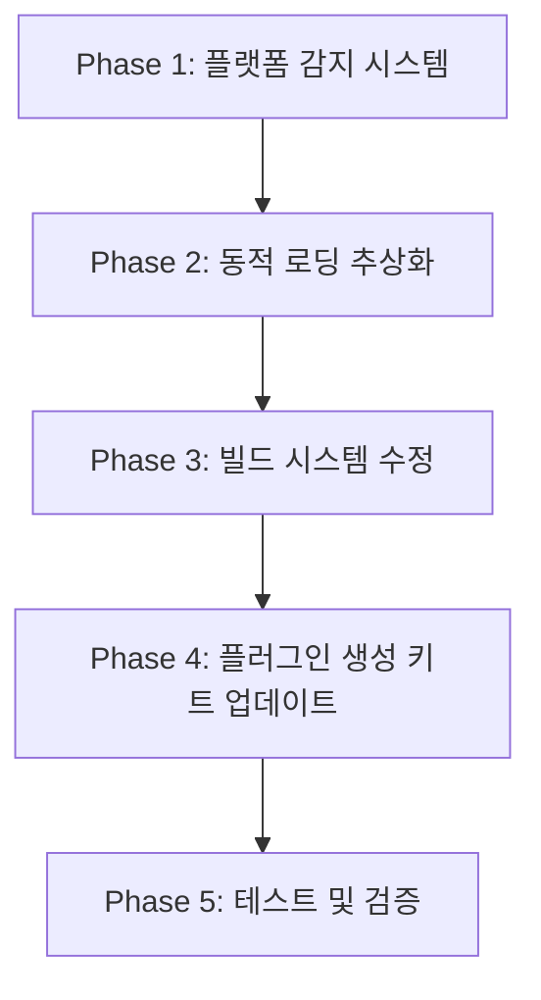
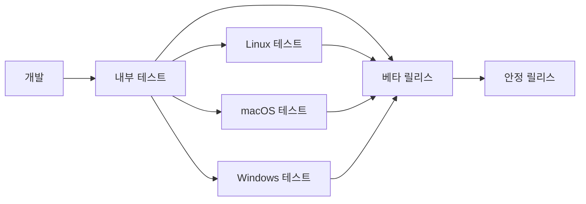

# 크로스 플랫폼 플러그인 시스템 마이그레이션 보고서

**작성일**: 2025-09-05 21:17  
**프로젝트**: OpenFrameworks GLSL 플러그인 시스템  
**대상**: Linux 전용 → Linux/macOS 크로스 플랫폼 지원

---

## 목차

1. [현재 상황 분석](#1-현재-상황-분석)
2. [크로스 플랫폼 요구사항](#2-크로스-플랫폼-요구사항)
3. [기술적 차이점 분석](#3-기술적-차이점-분석)
4. [마이그레이션 전략](#4-마이그레이션-전략)
5. [구현 세부사항](#5-구현-세부사항)
6. [수정 사항 상세](#6-수정-사항-상세)
7. [테스트 전략](#7-테스트-전략)
8. [배포 및 유지보수](#8-배포-및-유지보수)

---

## 1. 현재 상황 분석

### 1.1 Linux 전용 구현 현황

현재 시스템은 완전히 Linux 환경에 의존하는 구조로 구현되어 있음:

#### 1.1.1 플러그인 로딩 시스템

```cpp
// src/pluginSystem/PluginManager.h:6
#include <dlfcn.h>  // Linux/Unix 전용 동적 라이브러리 로딩

// src/pluginSystem/PluginManager.cpp:9
void* handle = dlopen(plugin_path.c_str(), RTLD_LAZY);  // POSIX 전용

// src/pluginSystem/PluginManager.cpp:17,32,61
dlsym(handle, "symbol_name");  // POSIX 심볼 해결
dlclose(handle);               // POSIX 라이브러리 해제
```

#### 1.1.2 플러그인 파일 확장자

```cpp
// src/geMain.cpp:36
sub_directory.allowExt("so");  // Linux 전용 .so 파일만 허용

// src/geMain.cpp:66-67
size_t pos = plugin_name.rfind(".so");  // 하드코딩된 .so 확장자
```

#### 1.1.3 플러그인 생성 키트

```python
# glsl-plugin-dev-kit/plugin_generator.py:667,731
SUFFIX ".so"  # CMake에서 강제로 .so 확장자 지정

# glsl-plugin-dev-kit/plugin_generator.py:672-674,736-738
target_compile_options(plugin_name PRIVATE
    -fvisibility=hidden  # GCC/Clang 전용 컴파일러 플래그
    -fPIC               # Position Independent Code (Linux 전용)
)
```

### 1.2 OpenFrameworks 크로스 플랫폼 지원 현황

OpenFrameworks는 공식적으로 Linux, macOS, Windows, iOS, Android를 지원하지만, 현재 플러그인 시스템은 이 기능을 활용하지 않음.

---

## 2. 크로스 플랫폼 요구사항

### 2.1 지원 대상 플랫폼

| 플랫폼 | 동적 라이브러리 확장자 | 로딩 API | 컴파일러 |
|--------|-------------------|----------|----------|
| Linux | `.so` | `dlopen/dlsym/dlclose` | GCC/Clang |
| macOS | `.dylib` | `dlopen/dlsym/dlclose` | Clang/Apple Clang |
| Windows | `.dll` | `LoadLibrary/GetProcAddress/FreeLibrary` | MSVC/MinGW |

### 2.2 OpenFrameworks 플랫폼 감지

OpenFrameworks는 다음 매크로를 통해 플랫폼을 구분함:

```cpp
#ifdef TARGET_OSX
    // macOS 특화 코드
#elif defined(TARGET_LINUX)
    // Linux 특화 코드  
#elif defined(TARGET_WIN32)
    // Windows 특화 코드
#endif
```

---

## 3. 기술적 차이점 분석

### 3.1 동적 라이브러리 로딩

#### 3.1.1 API 차이점

```cpp
// Linux/macOS (POSIX)
void* handle = dlopen("libplugin.so", RTLD_LAZY);
void* symbol = dlsym(handle, "functionName");
dlclose(handle);

// Windows
HMODULE handle = LoadLibrary(L"plugin.dll");
FARPROC symbol = GetProcAddress(handle, "functionName");
FreeLibrary(handle);
```

#### 3.1.2 파일 확장자 차이점

- **Linux**: `.so` (Shared Object)
- **macOS**: `.dylib` (Dynamic Library) 또는 `.so` (호환성)
- **Windows**: `.dll` (Dynamic Link Library)

#### 3.1.3 컴파일 플래그 차이점

```cmake
# Linux/macOS (GCC/Clang)
target_compile_options(plugin PRIVATE -fPIC -fvisibility=hidden)

# Windows (MSVC)
target_compile_options(plugin PRIVATE /EHsc)
target_compile_definitions(plugin PRIVATE _WIN32_WINNT=0x0601)
```

### 3.2 경로 및 파일 시스템

```cpp
// POSIX (Linux/macOS)
const char* separator = "/";
const char* extension = ".so";    // Linux
const char* extension = ".dylib"; // macOS

// Windows
const char* separator = "\\";
const char* extension = ".dll";
```

---

## 4. 마이그레이션 전략

### 4.1 단계별 접근 방식



### 4.2 호환성 전략

1. **하위 호환성 유지**: 기존 Linux `.so` 플러그인 계속 지원
2. **점진적 마이그레이션**: 새 플래그인은 크로스 플랫폼으로 생성
3. **자동 플랫폼 감지**: 런타임에 적절한 확장자 자동 선택

---

## 5. 구현 세부사항

### 5.1 플랫폼 감지 및 추상화 레이어

#### 5.1.1 PlatformUtils 클래스 설계

```cpp
// src/platformUtils/PlatformUtils.h
#pragma once
#include "ofMain.h"
#include <string>
#include <vector>

class PlatformUtils {
public:
    enum Platform {
        LINUX,
        MACOS,
        WINDOWS,
        UNKNOWN
    };
    
    static Platform getCurrentPlatform();
    static std::string getDynamicLibraryExtension();
    static std::string getDynamicLibraryPrefix();
    static std::vector<std::string> getAllSupportedExtensions();
    static std::string normalizePath(const std::string& path);
    
private:
    static Platform platform_cache;
    static bool platform_detected;
};
```

#### 5.1.2 동적 로딩 추상화 클래스

```cpp
// src/platformUtils/DynamicLoader.h
#pragma once
#include "PlatformUtils.h"

class DynamicLoader {
public:
    struct LibraryHandle {
        void* handle;
        std::string path;
        bool is_valid;
    };
    
    static LibraryHandle loadLibrary(const std::string& path);
    static void* getSymbol(const LibraryHandle& lib, const std::string& symbol_name);
    static bool unloadLibrary(LibraryHandle& lib);
    static std::string getLastError();
    
private:
    static std::string formatError(const std::string& operation, const std::string& detail);
};
```

### 5.2 PluginManager 수정사항

#### 5.2.1 헤더 파일 개선

```cpp
// src/pluginSystem/PluginManager.h
#pragma once
#include "../glsl-plugin-interface/include/IPluginInterface.h"
#include "../shaderSystem/MinimalBuiltinChecker.h"
#include "../platformUtils/DynamicLoader.h"
#include "../platformUtils/PlatformUtils.h"
#include <unordered_map>
#include <memory>
#include <set>
#include <map>

// 플랫폼별 헤더를 조건부 포함하지 않고 추상화 레이어 사용
// #include <dlfcn.h> 제거됨
```

#### 5.2.2 구현 파일 주요 변경사항

```cpp
// src/pluginSystem/PluginManager.cpp
bool PluginManager::loadPlugin(const std::string& plugin_path, const std::string& alias) {
    // 이전: void* handle = dlopen(plugin_path.c_str(), RTLD_LAZY);
    // 이후: 플랫폼 추상화 사용
    DynamicLoader::LibraryHandle lib_handle = DynamicLoader::loadLibrary(plugin_path);
    
    if (!lib_handle.is_valid) {
        ofLogError("PluginManager") << "Cannot load plugin: " << DynamicLoader::getLastError();
        return false;
    }
    
    // 이전: dlsym(handle, "getPluginABIVersion")
    // 이후: 추상화된 심볼 해결
    typedef int (*get_abi_version_t)();
    get_abi_version_t get_abi_version = 
        (get_abi_version_t) DynamicLoader::getSymbol(lib_handle, "getPluginABIVersion");
    
    // 나머지 로직은 유사하게 수정...
}
```

### 5.3 플러그인 검색 개선

#### 5.3.1 다중 확장자 지원

```cpp
// src/geMain.cpp - findPluginFiles() 수정
std::vector<std::string> graphicsEngine::findPluginFiles() {
    std::vector<std::string> plugin_files;
    std::vector<std::string> supported_extensions = PlatformUtils::getAllSupportedExtensions();
    
    std::string data_path = ofToDataPath("", true);
    std::string plugins_dir = data_path + "/plugins/";
    
    ofDirectory dir(plugins_dir);
    if (!dir.exists()) {
        ofLogWarning("graphicsEngine") << "Plugins directory not found: " << plugins_dir;
        return plugin_files;
    }

    for (const auto& sub_dir : dir.getFiles()) {
        if (sub_dir.isDirectory()) {
            ofDirectory sub_directory(sub_dir.getAbsolutePath());
            
            // 모든 지원되는 확장자 허용
            for (const std::string& ext : supported_extensions) {
                sub_directory.allowExt(ext);
            }
            
            sub_directory.listDir();
            for (size_t i = 0; i < sub_directory.size(); i++) {
                plugin_files.push_back(sub_directory.getPath(i));
            }
        }
    }

    return plugin_files;
}
```

#### 5.3.2 플러그인 이름 정규화

```cpp
// src/geMain.cpp - loadAllPlugins() 수정
void graphicsEngine::loadAllPlugins() {
    auto plugin_files = findPluginFiles();
    
    for (const auto& plugin_path : plugin_files) {
        std::string filename = ofFilePath::getFileName(plugin_path);
        std::string plugin_name = normalizePluginName(filename);
        
        if (plugin_manager->loadPlugin(plugin_path, plugin_name)) {
            // 성공 로직...
        }
    }
}

// 새로운 헬퍼 함수
std::string graphicsEngine::normalizePluginName(const std::string& filename) {
    std::string name = filename;
    
    // 플랫폼별 prefix 제거
    std::string prefix = PlatformUtils::getDynamicLibraryPrefix();
    if (!prefix.empty() && name.rfind(prefix, 0) == 0) {
        name = name.substr(prefix.length());
    }
    
    // 모든 지원되는 확장자 제거
    std::vector<std::string> extensions = PlatformUtils::getAllSupportedExtensions();
    for (const std::string& ext : extensions) {
        std::string full_ext = "." + ext;
        size_t pos = name.rfind(full_ext);
        if (pos != std::string::npos && pos + full_ext.length() == name.length()) {
            name = name.substr(0, pos);
            break;
        }
    }
    
    return name;
}
```

---

## 6. 수정 사항 상세

### 6.1 플러그인 생성 키트 수정

#### 6.1.1 CMakeLists.txt 템플릿 개선

```python
# glsl-plugin-dev-kit/plugin_generator.py
def generate_cmake_content_cross_platform(plugin_name, source_files):
    return f"""cmake_minimum_required(VERSION 3.16)
project({plugin_name}Plugin)

set(CMAKE_CXX_STANDARD 17)
set(CMAKE_CXX_STANDARD_REQUIRED ON)

# 플랫폼별 설정
if(APPLE)
    set(CMAKE_MACOSX_RPATH ON)
    set(CMAKE_INSTALL_RPATH "@loader_path")
elseif(WIN32)
    # Windows 특화 설정
    add_definitions(-DNOMINMAX)
    add_definitions(-D_WIN32_WINNT=0x0601)
endif()

# Interface 라이브러리 찾기
find_path(PLUGIN_INTERFACE_DIR 
    NAMES IPluginInterface.h 
    PATHS ../glsl-plugin-interface/include 
          ../../glsl-plugin-interface/include
    REQUIRED
)

# Interface 라이브러리 생성
add_library(GLSLPluginInterface INTERFACE)
target_include_directories(GLSLPluginInterface INTERFACE ${{PLUGIN_INTERFACE_DIR}})

# 소스 파일 목록
set(PLUGIN_SOURCES
    {plugin_name}.cpp
    {plugin_name}Impl.cpp"""

    # 각 소스 파일 추가
    for source_file in source_files:
        content += f"\n    {source_file}"
    
    content += f"""
)

# 공유 라이브러리 생성
add_library({plugin_name} SHARED ${{PLUGIN_SOURCES}})

# Interface와 링크
target_link_libraries({plugin_name} PRIVATE GLSLPluginInterface)

# 플랫폼별 라이브러리 속성
if(APPLE)
    set_target_properties({plugin_name} PROPERTIES
        PREFIX "lib"
        SUFFIX ".dylib"
        POSITION_INDEPENDENT_CODE ON
        MACOSX_RPATH ON
        INSTALL_RPATH "@loader_path"
    )
    target_compile_options({plugin_name} PRIVATE
        -fvisibility=hidden
        -fPIC
    )
elseif(UNIX AND NOT APPLE)
    # Linux
    set_target_properties({plugin_name} PROPERTIES
        PREFIX "lib"
        SUFFIX ".so"
        POSITION_INDEPENDENT_CODE ON
    )
    target_compile_options({plugin_name} PRIVATE
        -fvisibility=hidden
        -fPIC
    )
elseif(WIN32)
    # Windows
    set_target_properties({plugin_name} PROPERTIES
        PREFIX ""
        SUFFIX ".dll"
    )
    target_compile_definitions({plugin_name} PRIVATE
        PLUGIN_EXPORTS
        _WIN32_WINNT=0x0601
        NOMINMAX
    )
endif()

# 공통 컴파일 정의
target_compile_definitions({plugin_name} PRIVATE
    PLUGIN_EXPORTS
)

# 디버그 설정
if(CMAKE_BUILD_TYPE STREQUAL "Debug")
    target_compile_definitions({plugin_name} PRIVATE DEBUG=1)
endif()
"""
    return content
```

#### 6.1.2 Python 생성 스크립트 개선

```python
# glsl-plugin-dev-kit/plugin_generator.py
import platform

class CrossPlatformPluginGenerator:
    def __init__(self):
        self.current_platform = platform.system()
        self.target_platforms = ['Linux', 'Darwin', 'Windows']  # Darwin = macOS
    
    def get_library_extension(self, platform_name=None):
        if platform_name is None:
            platform_name = self.current_platform
            
        extensions = {
            'Linux': 'so',
            'Darwin': 'dylib',  # macOS
            'Windows': 'dll'
        }
        return extensions.get(platform_name, 'so')
    
    def get_library_prefix(self, platform_name=None):
        if platform_name is None:
            platform_name = self.current_platform
            
        prefixes = {
            'Linux': 'lib',
            'Darwin': 'lib',   # macOS
            'Windows': ''      # Windows doesn't use lib prefix
        }
        return prefixes.get(platform_name, 'lib')
    
    def generate_platform_specific_cmake(self, plugin_name, source_files):
        # 위에서 정의한 generate_cmake_content_cross_platform 사용
        return generate_cmake_content_cross_platform(plugin_name, source_files)
    
    def generate_build_script(self, plugin_name):
        """각 플랫폼별 빌드 스크립트 생성"""
        scripts = {}
        
        # Linux/macOS용 bash 스크립트
        scripts['build.sh'] = f"""#!/bin/bash
set -e

echo "Building {plugin_name} plugin for $(uname -s)..."

# 빌드 디렉토리 생성
mkdir -p build
cd build

# CMake 설정
cmake .. -DCMAKE_BUILD_TYPE=Release

# 빌드
make -j$(nproc 2>/dev/null || echo 4)

echo "Build completed. Plugin library:"
ls -la *.so *.dylib 2>/dev/null || true
"""

        # Windows용 batch 스크립트
        scripts['build.bat'] = f"""@echo off
echo Building {plugin_name} plugin for Windows...

if not exist build mkdir build
cd build

cmake .. -DCMAKE_BUILD_TYPE=Release
cmake --build . --config Release

echo Build completed. Plugin library:
dir *.dll 2>nul
"""

        return scripts
```

### 6.2 플랫폼별 구현 파일

#### 6.2.1 PlatformUtils 구현

```cpp
// src/platformUtils/PlatformUtils.cpp
#include "PlatformUtils.h"

PlatformUtils::Platform PlatformUtils::platform_cache = PlatformUtils::UNKNOWN;
bool PlatformUtils::platform_detected = false;

PlatformUtils::Platform PlatformUtils::getCurrentPlatform() {
    if (!platform_detected) {
#ifdef TARGET_OSX
        platform_cache = MACOS;
#elif defined(TARGET_LINUX)
        platform_cache = LINUX;
#elif defined(TARGET_WIN32)
        platform_cache = WINDOWS;
#else
        platform_cache = UNKNOWN;
        ofLogWarning("PlatformUtils") << "Unknown platform detected";
#endif
        platform_detected = true;
    }
    return platform_cache;
}

std::string PlatformUtils::getDynamicLibraryExtension() {
    switch (getCurrentPlatform()) {
        case LINUX:
            return "so";
        case MACOS:
            return "dylib";
        case WINDOWS:
            return "dll";
        default:
            return "so";  // 기본값
    }
}

std::string PlatformUtils::getDynamicLibraryPrefix() {
    switch (getCurrentPlatform()) {
        case LINUX:
        case MACOS:
            return "lib";
        case WINDOWS:
            return "";  // Windows는 prefix 없음
        default:
            return "lib";
    }
}

std::vector<std::string> PlatformUtils::getAllSupportedExtensions() {
    std::vector<std::string> extensions;
    
    // 현재 플랫폼의 기본 확장자 추가
    extensions.push_back(getDynamicLibraryExtension());
    
    // macOS의 경우 .so도 지원 (호환성)
    if (getCurrentPlatform() == MACOS) {
        extensions.push_back("so");
    }
    
    return extensions;
}

std::string PlatformUtils::normalizePath(const std::string& path) {
    std::string normalized = path;
    
#ifdef TARGET_WIN32
    // Windows: / → \\ 변환
    std::replace(normalized.begin(), normalized.end(), '/', '\\');
#else
    // UNIX 계열: \\ → / 변환
    std::replace(normalized.begin(), normalized.end(), '\\', '/');
#endif

    return normalized;
}
```

#### 6.2.2 DynamicLoader 구현

```cpp
// src/platformUtils/DynamicLoader.cpp
#include "DynamicLoader.h"
#include "ofLog.h"

// 플랫폼별 헤더 포함
#ifdef TARGET_WIN32
    #include <windows.h>
#else
    #include <dlfcn.h>
#endif

DynamicLoader::LibraryHandle DynamicLoader::loadLibrary(const std::string& path) {
    LibraryHandle handle;
    handle.path = path;
    handle.is_valid = false;
    
#ifdef TARGET_WIN32
    // Windows 구현
    std::wstring wpath(path.begin(), path.end());
    HMODULE module = LoadLibraryW(wpath.c_str());
    if (module) {
        handle.handle = reinterpret_cast<void*>(module);
        handle.is_valid = true;
    }
#else
    // POSIX (Linux/macOS) 구현
    void* lib = dlopen(path.c_str(), RTLD_LAZY);
    if (lib) {
        handle.handle = lib;
        handle.is_valid = true;
    }
#endif

    if (!handle.is_valid) {
        ofLogError("DynamicLoader") << "Failed to load library: " << path 
                                   << " - " << getLastError();
    }
    
    return handle;
}

void* DynamicLoader::getSymbol(const LibraryHandle& lib, const std::string& symbol_name) {
    if (!lib.is_valid) {
        return nullptr;
    }
    
#ifdef TARGET_WIN32
    HMODULE module = reinterpret_cast<HMODULE>(lib.handle);
    return reinterpret_cast<void*>(GetProcAddress(module, symbol_name.c_str()));
#else
    return dlsym(lib.handle, symbol_name.c_str());
#endif
}

bool DynamicLoader::unloadLibrary(LibraryHandle& lib) {
    if (!lib.is_valid) {
        return true;
    }
    
    bool success = false;
    
#ifdef TARGET_WIN32
    HMODULE module = reinterpret_cast<HMODULE>(lib.handle);
    success = (FreeLibrary(module) != 0);
#else
    success = (dlclose(lib.handle) == 0);
#endif

    if (success) {
        lib.handle = nullptr;
        lib.is_valid = false;
    }
    
    return success;
}

std::string DynamicLoader::getLastError() {
#ifdef TARGET_WIN32
    DWORD error = GetLastError();
    if (error == 0) return "No error";
    
    LPSTR messageBuffer = nullptr;
    size_t size = FormatMessageA(
        FORMAT_MESSAGE_ALLOCATE_BUFFER | FORMAT_MESSAGE_FROM_SYSTEM | FORMAT_MESSAGE_IGNORE_INSERTS,
        NULL, error, MAKELANGID(LANG_NEUTRAL, SUBLANG_DEFAULT),
        (LPSTR)&messageBuffer, 0, NULL);
    
    std::string message(messageBuffer, size);
    LocalFree(messageBuffer);
    
    return message;
#else
    const char* error = dlerror();
    return error ? std::string(error) : "No error";
#endif
}
```

---

## 7. 테스트 전략

### 7.1 단위 테스트

#### 7.1.1 플랫폼 감지 테스트

```cpp
// tests/PlatformUtilsTest.cpp
#include "gtest/gtest.h"
#include "../src/platformUtils/PlatformUtils.h"

class PlatformUtilsTest : public ::testing::Test {
protected:
    void SetUp() override {}
    void TearDown() override {}
};

TEST_F(PlatformUtilsTest, DetectCurrentPlatform) {
    PlatformUtils::Platform platform = PlatformUtils::getCurrentPlatform();
    EXPECT_NE(platform, PlatformUtils::UNKNOWN);
}

TEST_F(PlatformUtilsTest, GetCorrectExtension) {
    std::string extension = PlatformUtils::getDynamicLibraryExtension();
    
#ifdef TARGET_OSX
    EXPECT_EQ(extension, "dylib");
#elif defined(TARGET_LINUX)
    EXPECT_EQ(extension, "so");
#elif defined(TARGET_WIN32)
    EXPECT_EQ(extension, "dll");
#endif
}

TEST_F(PlatformUtilsTest, GetSupportedExtensions) {
    auto extensions = PlatformUtils::getAllSupportedExtensions();
    EXPECT_FALSE(extensions.empty());
    
    std::string primary = PlatformUtils::getDynamicLibraryExtension();
    EXPECT_NE(std::find(extensions.begin(), extensions.end(), primary), extensions.end());
}
```

#### 7.1.2 동적 로딩 테스트

```cpp
// tests/DynamicLoaderTest.cpp
#include "gtest/gtest.h"
#include "../src/platformUtils/DynamicLoader.h"

class DynamicLoaderTest : public ::testing::Test {
protected:
    void SetUp() override {
        // 테스트용 더미 라이브러리 생성
        createTestLibrary();
    }
    
    void TearDown() override {
        // 정리
        cleanupTestLibrary();
    }
    
    void createTestLibrary();
    void cleanupTestLibrary();
    
    std::string test_library_path;
};

TEST_F(DynamicLoaderTest, LoadValidLibrary) {
    auto handle = DynamicLoader::loadLibrary(test_library_path);
    EXPECT_TRUE(handle.is_valid);
    
    bool unloaded = DynamicLoader::unloadLibrary(handle);
    EXPECT_TRUE(unloaded);
    EXPECT_FALSE(handle.is_valid);
}

TEST_F(DynamicLoaderTest, LoadInvalidLibrary) {
    auto handle = DynamicLoader::loadLibrary("/nonexistent/library.ext");
    EXPECT_FALSE(handle.is_valid);
}

TEST_F(DynamicLoaderTest, GetSymbolFromLibrary) {
    auto handle = DynamicLoader::loadLibrary(test_library_path);
    ASSERT_TRUE(handle.is_valid);
    
    void* symbol = DynamicLoader::getSymbol(handle, "testFunction");
    // 실제 심볼이 있다면 nullptr이 아니어야 함
    
    DynamicLoader::unloadLibrary(handle);
}
```

### 7.2 통합 테스트

#### 7.2.1 플러그인 로딩 테스트

```cpp
// tests/CrossPlatformPluginTest.cpp
#include "gtest/gtest.h"
#include "../src/pluginSystem/PluginManager.h"
#include "../src/platformUtils/PlatformUtils.h"

class CrossPlatformPluginTest : public ::testing::Test {
protected:
    void SetUp() override {
        plugin_manager = std::make_unique<PluginManager>();
        generateTestPlugins();
    }
    
    void generateTestPlugins();
    
    std::unique_ptr<PluginManager> plugin_manager;
    std::vector<std::string> test_plugin_paths;
};

TEST_F(CrossPlatformPluginTest, LoadPluginWithCorrectExtension) {
    std::string extension = PlatformUtils::getDynamicLibraryExtension();
    std::string test_plugin = "test_plugin." + extension;
    
    // 플러그인 로딩 테스트
    bool loaded = plugin_manager->loadPlugin(test_plugin, "test");
    EXPECT_TRUE(loaded);
    
    // 플러그인 조회 테스트
    EXPECT_TRUE(plugin_manager->isPluginLoaded("test"));
}

TEST_F(CrossPlatformPluginTest, LoadMultipleExtensions) {
    // macOS에서 .so와 .dylib 둘 다 테스트
    if (PlatformUtils::getCurrentPlatform() == PlatformUtils::MACOS) {
        bool loaded_so = plugin_manager->loadPlugin("test_plugin.so", "test_so");
        bool loaded_dylib = plugin_manager->loadPlugin("test_plugin.dylib", "test_dylib");
        
        EXPECT_TRUE(loaded_so);
        EXPECT_TRUE(loaded_dylib);
    }
}
```

### 7.3 자동화 테스트 환경

#### 7.3.1 GitHub Actions 설정

```yaml
# .github/workflows/cross-platform-test.yml
name: Cross Platform Plugin Tests

on:
  push:
    branches: [ main, develop ]
  pull_request:
    branches: [ main ]

jobs:
  test-linux:
    runs-on: ubuntu-latest
    steps:
    - uses: actions/checkout@v3
    
    - name: Install dependencies
      run: |
        sudo apt-get update
        sudo apt-get install -y build-essential cmake libgl1-mesa-dev
        
    - name: Install OpenFrameworks
      run: |
        wget https://openframeworks.cc/versions/v0.12.0/of_v0.12.0_linux64gcc6_release.tar.gz
        tar -xzf of_v0.12.0_linux64gcc6_release.tar.gz
        
    - name: Build and test
      run: |
        cd apps/graphicsEngine/scratch
        mkdir build && cd build
        cmake ..
        make -j$(nproc)
        ctest --verbose

  test-macos:
    runs-on: macos-latest
    steps:
    - uses: actions/checkout@v3
    
    - name: Install dependencies
      run: |
        brew install cmake
        
    - name: Install OpenFrameworks
      run: |
        wget https://openframeworks.cc/versions/v0.12.0/of_v0.12.0_osx_release.zip
        unzip of_v0.12.0_osx_release.zip
        
    - name: Build and test
      run: |
        cd apps/graphicsEngine/scratch
        mkdir build && cd build
        cmake ..
        make -j$(sysctl -n hw.ncpu)
        ctest --verbose

  test-windows:
    runs-on: windows-latest
    steps:
    - uses: actions/checkout@v3
    
    - name: Install OpenFrameworks
      run: |
        Invoke-WebRequest -Uri "https://openframeworks.cc/versions/v0.12.0/of_v0.12.0_vs2017_release.zip" -OutFile "of.zip"
        Expand-Archive -Path "of.zip" -DestinationPath "."
        
    - name: Build and test
      run: |
        cd apps/graphicsEngine/scratch
        mkdir build
        cd build
        cmake .. -G "Visual Studio 17 2022"
        cmake --build . --config Release
        ctest --verbose -C Release
```

---

## 8. 배포 및 유지보수

### 8.1 배포 전략

#### 8.1.1 단계적 배포



#### 8.1.2 버전 관리

- **메이저 버전 (v2.0.0)**: 크로스 플랫폼 지원 추가
- **마이너 버전 (v2.1.0)**: 새로운 플랫폼 지원 추가
- **패치 버전 (v2.0.1)**: 버그 수정 및 성능 개선

#### 8.1.3 하위 호환성 정책

```cpp
// 기존 Linux 전용 API 유지 (deprecated 처리)
class PluginManager {
public:
    // 새로운 크로스 플랫폼 API
    bool loadPlugin(const std::string& plugin_path, const std::string& alias = "");
    
    // 기존 API (deprecated, 하위 호환성을 위해 유지)
    [[deprecated("Use loadPlugin() with automatic platform detection")]]
    bool loadPluginLinux(const std::string& plugin_path, const std::string& alias = "");
};
```

### 8.2 문서화

#### 8.2.1 사용자 가이드

```markdown
# 크로스 플랫폼 플러그인 가이드

## 플러그인 생성

### Linux/macOS
```bash
python3 plugin_generator.py MyPlugin /path/to/glsl/files /output/path
cd /output/path
./build.sh
```

### Windows
```cmd
python plugin_generator.py MyPlugin C:\path\to\glsl\files C:\output\path
cd C:\output\path
build.bat
```

## 플러그인 설치

생성된 플러그인 파일을 다음 위치에 복사:
- Linux: `libMyPlugin.so`
- macOS: `libMyPlugin.dylib`
- Windows: `MyPlugin.dll`

대상 디렉토리: `bin/data/plugins/MyPlugin/`
```

#### 8.2.2 개발자 문서

```markdown
# 크로스 플랫폼 개발 가이드

## 새로운 플랫폼 지원 추가

1. `PlatformUtils.h`에 새 플랫폼 열거형 추가
2. `PlatformUtils.cpp`에 감지 로직 추가  
3. `DynamicLoader.cpp`에 로딩 구현 추가
4. CMake 템플릿에 빌드 설정 추가
5. 테스트 케이스 작성

## 플랫폼별 주의사항

### macOS
- Code signing 요구사항
- SIP (System Integrity Protection) 고려
- Gatekeeper 정책

### Windows  
- DLL Hell 문제 예방
- Visual C++ Redistributable 종속성
- Windows Defender 정책
```

### 8.3 모니터링 및 로깅

#### 8.3.1 플랫폼별 통계 수집

```cpp
// src/analytics/PlatformAnalytics.h
class PlatformAnalytics {
public:
    struct UsageStats {
        std::string platform;
        std::string version;
        int plugin_count;
        int successful_loads;
        int failed_loads;
        std::vector<std::string> error_messages;
    };
    
    static void recordPluginLoad(const std::string& plugin_name, bool success);
    static void recordError(const std::string& operation, const std::string& error);
    static UsageStats generateReport();
    static void sendTelemetry(const UsageStats& stats);  // opt-in
};
```

#### 8.3.2 디버그 로깅 개선

```cpp
// 플랫폼별 상세 로그
void PluginManager::loadPlugin(const std::string& plugin_path, const std::string& alias) {
    ofLogNotice("PluginManager") << "Loading plugin on " << PlatformUtils::getPlatformName()
                                 << " - Path: " << plugin_path 
                                 << " - Expected extension: " << PlatformUtils::getDynamicLibraryExtension();
    
    PlatformAnalytics::recordPluginLoad(alias, success);
    
    if (!success) {
        std::string error_details = formatErrorWithPlatformContext(DynamicLoader::getLastError());
        ofLogError("PluginManager") << "Plugin loading failed: " << error_details;
        PlatformAnalytics::recordError("plugin_load", error_details);
    }
}
```

---

## 결론 및 권장사항

### 실행 우선순위

1. **Phase 1 (1-2주)**: PlatformUtils와 DynamicLoader 구현
2. **Phase 2 (1주)**: PluginManager 수정 및 테스트
3. **Phase 3 (1주)**: 플러그인 생성 키트 업데이트
4. **Phase 4 (1주)**: 통합 테스트 및 문서화
5. **Phase 5 (1주)**: 베타 릴리스 및 피드백 수집

### 리스크 완화 방안

- **하위 호환성**: 기존 Linux `.so` 플러그인 계속 지원
- **점진적 배포**: 플랫폼별 순차적 롤아웃
- **롤백 계획**: 문제 발생 시 이전 버전으로 복구 가능

### 기대 효과

- **사용자 기반 확대**: macOS 사용자 접근성 향상
- **개발 생산성**: 플랫폼별 별도 코드 유지 불필요
- **유지보수성**: 통합된 코드베이스로 관리 효율성 증대

이 마이그레이션을 통해 OpenFrameworks의 크로스 플랫폼 철학에 부합하는 진정한 멀티플랫폼 GLSL 플러그인 시스템을 구축할 수 있습니다.